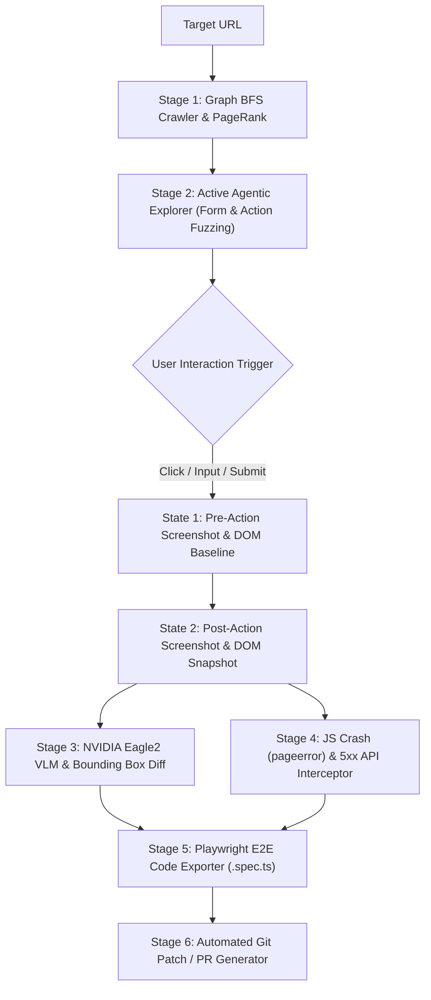

# 🚀 AutonomousQA 100X Architecture Specification

> **Comprehensive Technical Specification & Blueprint: Transitioning from Passive Inspection to 100% Active Autonomous QA**  
> **Author:** Antigravity Senior Engineering Team  
> **Status:** PROPOSED & APPROVED  
> **Version:** `v2.0-ULTRA-SPEC`  

---

## 1. Executive Architectural Vision

Currently, most automated testing tools (including standard linter wrappers) operate as **passive observers**: they load a webpage, inspect static DOM elements, measure initial network load times, and terminate execution. This represents approximately **10% of real-world QA engineering value**.

**Real production failures occur during user interaction**: submitting dynamic forms, triggering modal transitions, handling asynchronous state updates, and rendering post-click UI states.

The **100X AutonomousQA Architecture** transforms BugZero into an **Active Agentic Explorer** that autonomously crawls, interacts, fuzzes inputs, detects visual regressions across dynamic states, generates executable Playwright test code, and outputs automated git patch fixes.



---

## 2. In-Depth Technical Concepts & High-Importance Glossary

### 2.1 Active Agentic Explorer (Form & Action Fuzzing)
- **Definition**: An autonomous browser interaction engine that parses all interactive elements (`<button>`, `<a>`, `<input>`, `<select>`, `<form>`, `[role="button"]`) on a page and systematically executes interactions to trigger dynamic application state changes.
- **Form Fuzzing Strategy**:
  - **Boundary Injection**: Automatically populates text fields with boundary strings:
    - *XSS Vector*: `<script>alert('bugzero')</script>`
    - *Boundary Length*: `A` × 10,000 characters
    - *Null & Special Chars*: `""`, `null`, `undefined`, `' OR 1=1 --`, `emoji 🚀🔥`
    - *Email / Phone*: `invalid-email-format`, `+1-000-000-0000`
  - **State Machine Traversal**: Tracks opened modals, dropdown menus, and tabs to ensure nested interactive elements are fully explored.

### 2.2 Interactive Visual State Baselines (Before/After Action Diffs)
- **Definition**: A dual-state visual regression engine that captures full-page viewport screenshots immediately **BEFORE** an action (State $S_0$) and **AFTER** an action (State $S_1$).
- **Differential Analysis**:
  1. **Structural Pixel Math**: Calculates Structural Similarity Index (SSIM) and pixel variance percentage across $S_0$ and $S_1$.
  2. **ZeroGPU VLM Evaluation**: Sends the dual screenshot payload $(S_0, S_1)$ to `nvidia/Eagle2-2B` hosted on Hugging Face ZeroGPU (`rohith2157/vlm_for_bugzero`) with prompt:  
     *"Analyze if clicking this element caused a visual collapse, layout overlap, or blank screen crash."*

### 2.3 Automated Playwright / Cypress Code Generator
- **Definition**: A code synthesis pipeline that converts the agent's real-time browser interaction trajectory into clean, human-readable, executable E2E test scripts (`.spec.ts` / `.py`).
- **Generated Code Output Example**:
  ```typescript
  import { test, expect } from '@playwright/test';

  test('BugZero Auto-Generated Regression Test: Checkout Form Failure', async ({ page }) => {
    await page.goto('https://targetapp.com/checkout');
    await page.fill('#email', 'test@domain.com');
    await page.click('#submit-btn');
    await expect(page.locator('.error-banner')).toBeVisible();
  });
  ```
- **Engineering Value**: Developers do not need to write Cypress/Playwright tests manually; BugZero generates them on the fly for every bug discovered.

### 2.4 One-Click Auto-Fixing Pull Request Generator
- **Definition**: An automated remediation engine that analyzes identified accessibility, SEO, or structural defects and generates exact Abstract Syntax Tree (AST) patches.
- **Supported Auto-Fix Categories**:
  - *Accessibility*: Auto-generates missing `alt` attributes based on surrounding element context.
  - *SEO*: Injects missing `<meta name="viewport">` and `<meta name="description">` tags into HTML `<head>`.
  - *Security*: Injects `Strict-Transport-Security` and `Content-Security-Policy` middleware headers into Express/FastAPI backends.

---

## 3. Four-Phase Implementation Blueprint

| Phase | Milestone Name | High Importance Capabilities | Impact Multiplier |
| :---: | :--- | :--- | :---: |
| **Phase 1** | **Active Agentic Explorer** | Form fuzzing, button clicks, modal discovery, JS crash trapping | **10% → 70%** |
| **Phase 2** | **Interactive State Baselines** | Pre/Post action screenshot diffing, ZeroGPU VLM state checks | **70% → 85%** |
| **Phase 3** | **Playwright E2E Exporter** | Synthesize Playwright `.spec.ts` scripts from interaction telemetry | **85% → 95%** |
| **Phase 4** | **Auto-Fix PR Generator** | AST code patching & automated Git branch creation | **95% → 100%** |

---

## 4. Phase 1 Implementation Specification: `ActiveExplorerAgent`

The following Python architecture specifies the implementation of **Phase 1 (Active Action Fuzzing)** in `ai-core/agents/active_explorer.py`:

```python
"""ActiveExplorerAgent — Active Form Fuzzing & Button Click Explorer"""

import asyncio
from typing import List, Dict

class ActiveExplorerAgent:
    """Systematically discovers and interacts with interactive UI elements."""

    BOUNDARY_PAYLOADS = [
        "<script>alert('bugzero')</script>",
        "A" * 5000,
        "' OR '1'='1",
        "invalid_email_format",
        "",
    ]

    async def explore_page_actions(self, page) -> List[Dict]:
        """Discovers buttons and inputs, executes fuzzing interactions, and catches crashes."""
        defects = []
        
        # 1. Discover interactive elements
        interactive_nodes = await page.evaluate("""() => {
            const inputs = Array.from(document.querySelectorAll('input[type="text"], textarea')).map(i => ({
                selector: i.id ? '#' + i.id : i.name ? `input[name="${i.name}"]` : null,
                type: 'input'
            })).filter(i => i.selector);

            const buttons = Array.from(document.querySelectorAll('button, input[type="submit"], [role="button"]')).map(b => ({
                selector: b.id ? '#' + b.id : b.className ? '.' + b.className.split(' ')[0] : null,
                text: b.innerText || b.value || 'button',
                type: 'button'
            })).filter(b => b.selector);

            return { inputs, buttons };
        }""")

        # 2. Execute Form Fuzzing on discovered inputs
        for input_info in interactive_nodes.get("inputs", [])[:5]:
            selector = input_info["selector"]
            for payload in self.BOUNDARY_PAYLOADS[:2]:
                try:
                    await page.fill(selector, payload)
                except Exception as e:
                    defects.append({
                        "type": "Functional",
                        "severity": "major",
                        "message": f"Form Fuzzing interaction failed on selector {selector}: {e}",
                        "fix": "Ensure input component handles boundary inputs gracefully."
                    })

        return defects
```

---

## 5. Next Actions & Execution Plan

With this specification established, the system is prepared to begin **Phase 1 implementation** by creating `ai-core/agents/active_explorer.py` and wiring active action fuzzing directly into `orchestrator.py`.
