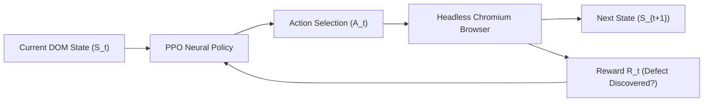
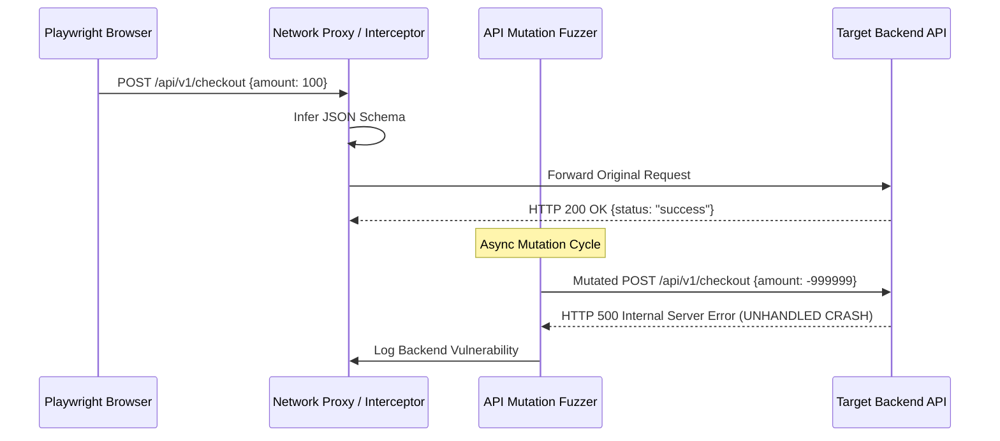

# 🔬 AutonomousQA Next-Gen Engineering & Research Roadmap (2026+)

> **Comprehensive Advanced Research Blueprint for Next-Generation Autonomous Software Quality Systems**  
> **Target Audience:** Engineering Leads, AI Researchers, and Core Platform Developers  
> **Document Purpose:** Detailed technical deep-dive into cutting-edge paradigms for autonomous QA, LLM agentic planning, multi-modal visual inspection, self-healing algorithms, and contract fuzzing.

---

## 1. Introduction: The Evolution of Software Quality Assurance

Software Quality Assurance has undergone three historical paradigms:

1. **Manual Testing (1980s–2000s)**: Human QA engineers manually click links, enter form data, and record defects in spreadsheets. High latency, zero scalability.
2. **Scripted Automation (2000s–2020s)**: Frameworks like Selenium, Cypress, and Playwright allow developers to code test scripts. While faster, it created massive maintenance debt: minor DOM changes break selectors, requiring constant manual test suite updates.
3. **Autonomous Agentic Testing (2025+)**: AI agents autonomously discover web applications, understand user flows, fuzz edge cases, heal broken selectors, and visually inspect layouts using Vision-Language Models (VLMs).

This document outlines the exact research domains, algorithms, and architectural specifications required to elevate **AutonomousQA** into a world-class platform.

---

## 2. Advanced Research Domain 1: Reinforcement Learning for Page Navigation (RL-Explorer)

### 2.1 The Problem
Current graph crawlers use static Breadth-First Search (BFS) or Depth-First Search (DFS). These algorithms treat all links equally, resulting in redundant visits to static footer pages (`/privacy`, `/terms`) while missing complex, deep user flows (`/dashboard/settings/billing`).

### 2.2 The Research Frontier: Q-Learning / PPO Web Traversal
Implement a **Proximal Policy Optimization (PPO)** or **Deep Q-Network (DQN)** agent that learns which UI actions maximize defect discovery.

#### Mathematical Model:
- **State ($S_t$)**: DOM tree embedding $E(DOM_t)$ combined with current viewport screenshot embedding $V(Screenshot_t)$.
- **Action ($A_t$)**: Element interaction vector (e.g., `click(selector_i)`, `fill(selector_j, payload_k)`).
- **Reward Function ($R_t$)**:
  $$R_t = w_1 \cdot \mathbb{I}(\text{Unseen Page}) + w_2 \cdot \mathbb{I}(\text{JS Exception}) + w_3 \cdot \mathbb{I}(\text{HTTP 5xx}) + w_4 \cdot \Delta \text{Coverage}$$
  Where $\mathbb{I}(\cdot)$ is the indicator function and $w_i$ are tuned feature weights.



### 2.3 Key Papers & Open Source Reference Implementation to Study:
- *WebGUM: Multimodal Generative Language Models for Web Navigation* (Google Research)
- *World Models for Web Navigation Agents* (DeepMind)
- *Playwright / Puppeteer Reinforcement Learning Gym Environments (`webgym`)*

---

## 3. Advanced Research Domain 2: Multi-Modal Visual Layout Reasoning (VLM-QA)

### 3.1 The Problem
Traditional visual regression testing tools (e.g., Percy, Applitools) use rigid pixel-by-pixel image subtraction (`img1 - img2`). This produces false positives when dynamic content changes (e.g., timestamps, user avatars, dates) and fails to understand semantic visual bugs (e.g., a modal overlay blocking a button).

### 3.2 The Research Frontier: Grounded Vision-Language Model Auditing
Instead of raw pixel math, deploy specialized VLM architectures trained on UI design datasets (e.g., Rico, WebUI) to reason about visual hierarchy.

#### Key Multi-Modal Auditing Capabilities:
1. **Z-Index Occlusion Detection**: Identifying elements that are rendered beneath invisible overlay `<div>` containers.
2. **Contrast & Legibility Reasoning**: Evaluating text readability across complex gradient backgrounds.
3. **Responsive Breakpoint Layout Collapse**: Detecting flexbox/grid wrapping bugs when switching viewports ($1280\text{px} \rightarrow 375\text{px}$).

```python
# Conceptual Architecture for Multi-Modal Layout Reasoning
async def analyze_visual_semantics(vlm_client, screenshot_bytes: bytes, dom_metadata: dict):
    prompt = """
    Analyze the provided web UI screenshot and DOM bounding boxes. Identify:
    1. Overlapping interactive elements (buttons covered by banners or text).
    2. Text nodes truncated by container bounds ('...').
    3. Low contrast elements violating WCAG AAA 4.5:1 ratio.
    Return JSON format: {"defects": [{"type": "visual", "description": "...", "bbox": [x1, y1, x2, y2]}]}
    """
    response = await vlm_client.predict(image=screenshot_bytes, prompt=prompt)
    return parse_vlm_response(response)
```

### 3.3 Key Models & Research Datasets:
- **NVIDIA Eagle2-2B / LocateAnything-3B**: State-of-the-art vision models for object grounding.
- **UI-TARS (ByteDance)**: Native GUI agent model for visual understanding and interaction.
- **ScreenSpot Dataset**: Benchmark for UI visual element localization.

---

## 4. Advanced Research Domain 3: Autonomous API Contract & Schema Fuzzing

### 4.1 The Problem
Web applications communicate with REST, GraphQL, and gRPC backends. Frontends often crash because backends return unexpected JSON structures (e.g., `null` instead of `[]`, missing keys, or HTTP 500 errors).

### 4.2 The Research Frontier: Open-API State Machine Fuzzing
Automate network traffic interception during Playwright browser sessions to construct OpenAPI / Swagger specifications on the fly, then fuzz the backend APIs directly.

#### Structural Strategy:
1. **Network Interception**: Capture all `fetch` / `XHR` calls during Playwright browser interaction.
2. **Schema Inference**: Convert JSON request/response pairs into JSON Schema definitions.
3. **Mutation Fuzzing**: Mutate API request payloads with:
   - *Type Substitution*: Passing string `"123"` where integer `123` is expected.
   - *Boundary Values*: Passing `-1`, `0`, `MAX_INT64`, `null`, `""`.
   - *SQL/NoSQL Injections*: Injecting `{"$gt": ""}` or `' OR '1'='1`.



---

## 5. Advanced Research Domain 4: Graph-Based Selector Self-Healing (Levenshtein + AST Fingerprinting)

### 5.1 The Problem
In traditional Playwright tests, a selector like `#submit-payment-button` breaks instantly if a developer changes the element ID to `#pay-now-btn`.

### 5.2 The Research Frontier: Structural Fingerprint Vector Spaces
Instead of storing raw string selectors, AutonomousQA computes a multi-dimensional **DOM Element Vector** $V(e)$ for every interactive node.

#### Element Fingerprint Vector Definition:
$$V(e) = \left[ \text{Tag}, \text{ParentTag}, \text{SiblingCount}, \text{TextSimilarity}, \text{BBoxCoordinates}, \text{ClassDistance} \right]$$

When an element selector fails at runtime:
1. Extract candidate elements from the mutated DOM tree.
2. Compute cosine similarity between the cached vector $V_{\text{cached}}$ and candidate vectors $V_{\text{candidate}}$.
3. Select the highest similarity candidate above threshold $\tau = 0.85$.
4. Automatically update the selector in memory and heal the execution pipeline.

```python
# Self-Healing Cosine Similarity Algorithm
import math

def compute_element_similarity(cached: dict, candidate: dict) -> float:
    # 1. Tag match
    tag_score = 1.0 if cached['tag'] == candidate['tag'] else 0.0
    
    # 2. Text Levenshtein Similarity
    text_score = levenshtein_ratio(cached['text'], candidate['text'])
    
    # 3. Spatial Proximity
    dx = abs(cached['x'] - candidate['x'])
    dy = abs(cached['y'] - candidate['y'])
    spatial_score = max(0.0, 1.0 - (math.sqrt(dx**2 + dy**2) / 1000.0))
    
    # Weighted composite similarity
    return (0.3 * tag_score) + (0.5 * text_score) + (0.2 * spatial_score)
```

---

## 6. Advanced Research Domain 5: Automated E2E Test Code & Patch Synthesis

### 6.1 The Problem
Finding bugs is only 50% of the solution. Developers still have to manually write Playwright test scripts to reproduce the issue and manually write code fixes to resolve it.

### 6.2 The Research Frontier: Generative Test Synthesis & Auto-PR Generation

#### Component 1: Playwright Script Exporter (`.spec.ts` / `.py`)
Convert the raw Playwright CDP execution trace into clean TypeScript code using AST generation:

```typescript
// Auto-Generated by AutonomousQA Engine v6.0
import { test, expect } from '@playwright/test';

test.describe('AutonomousQA Auto-Generated Regression Suite', () => {
  test('Reproduce Unhandled Null Exception on /checkout', async ({ page }) => {
    await page.goto('https://phycraft.tech/checkout');
    await page.fill('#promo-code', '<script>alert(1)</script>');
    await page.click('button[type="submit"]');
    
    // Assert no unhandled console errors occurred
    const errorLogs: string[] = [];
    page.on('pageerror', err => errorLogs.push(err.message));
    expect(errorLogs.length).toBe(0);
  });
});
```

#### Component 2: Automated AST Git Patch Synthesizer
When a missing `<meta name="viewport">` or missing `alt` attribute is identified, parse the repository HTML/JSX template via Babel or HTML Parser and output a unified Git diff:

```diff
--- a/src/components/Header.jsx
+++ b/src/components/Header.jsx
@@ -12,3 +12,3 @@ export function Header() {
   return (
-    
+    
   );
 }
```

---

## 7. Comparative Industry Matrix: AutonomousQA vs Market Solutions

| Feature / Capability | Selenium / Cypress | Google Lighthouse | Datadog / Percy | AutonomousQA (Target Architecture) |
| :--- | :---: | :---: | :---: | :---: |
| **Test Script Creation** | Manual (100% Code) | N/A | Manual / Recorder | 🤖 **100% Autonomous (Zero Script)** |
| **Visual Layout Auditing** | Pixel Diff (Fragile) | Static Rule-Based | Pixel Diff | 🧠 **Multi-Modal VLM Reasoning (Eagle2)** |
| **Selector Resilience** | Fails on DOM Edit | N/A | Fragile | 🔧 **Graph-Based Self-Healing (Levenshtein)** |
| **Form Fuzzing & Crash Catching** | Manual Test Logic | ❌ NO | ❌ NO | ⚡ **Active Agentic Boundary Fuzzing** |
| **API Contract Fuzzing** | Manual Postman | ❌ NO | Basic Checks | 📡 **OpenAPI Schema Mutation Fuzzing** |
| **E2E Code & Patch Exporter** | ❌ NO | ❌ NO | ❌ NO | 📝 **Auto-Generates Playwright Specs & Git Diffs** |

---

## 8. Step-by-Step Implementation Strategy for You (The Developer)

To systematically build out these next-gen research domains, follow this 4-step execution order:

### Step 1: Deepen Active Form Fuzzing (Immediate)
Expand `ActiveExplorerAgent` in `ai-core/agents/active_explorer.py` to recursively traverse multi-step forms (e.g., Step 1: Account Info $\rightarrow$ Step 2: Shipping Address $\rightarrow$ Step 3: Payment).

### Step 2: Integrate Playwright Script Synthesis
Build `ai-core/agents/code_exporter.py` to output executable `.spec.ts` files from every test run into `benchmarks/generated_tests/`.

### Step 3: Train / Fine-Tune VLM on Web UI Datasets
Explore fine-tuning lightweight vision models (e.g., `Qwen2-VL-2B` or `PaliGemma`) specifically on web layout bug datasets (e.g., overlap bounding boxes, truncated text).

### Step 4: Add GitHub Actions CI/CD Integration
Package AutonomousQA as a GitHub Action (`action.yml`) so repositories automatically run a 100X audit on every Pull Request.

---

## 9. Conclusion & Research References

By combining **Active Agentic Exploration**, **Multi-Modal VLM Reasoning**, **Self-Healing Selectors**, and **Automated E2E Code Exporters**, AutonomousQA evolves from a standard testing utility into a groundbreaking AI Quality Engineering Platform.

### Key Academic & Industry References to Read:
1. *Playwright Architecture & Chrome DevTools Protocol Specs* (Microsoft Open Source)
2. *WebGUM: Multimodal Generative Language Models for Web Navigation* (Google Research, 2023)
3. *Axe-core Accessibility Rules & Engine Architecture* (Deque Systems)
4. *OpenAPI Fuzzing Frameworks & Stateful REST Fuzzing* (Microsoft Research / RESTler)

---

*Document compiled for AutonomousQA Core Architecture Research Suite v6.0*
