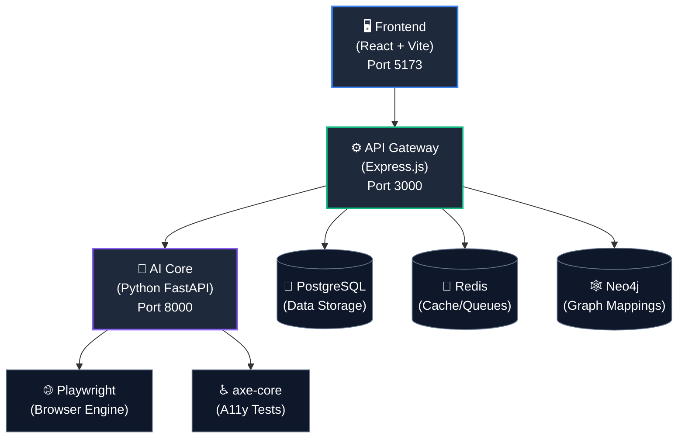
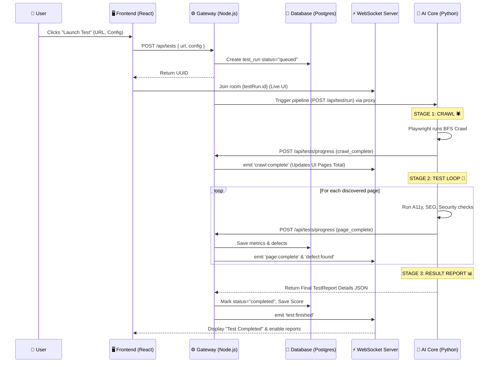

<div align="center">

  

  <h1>🚀 AutonomousQA</h1>

  <p>
    <strong>Zero-Touch • Zero-Script • Zero-Compromise</strong>
  </p>

  <p>
    <em>AI-powered, fully autonomous Quality Assurance engine that tests any web application — without a single line of test script.</em>
  </p>

  <p>
    <a href="https://github.com/rohith2157/BUGZERO/stargazers"></a>
    <a href="https://github.com/rohith2157/BUGZERO/network/members"></a>
    <a href="https://github.com/rohith2157/BUGZERO/issues"></a>
    <a href="https://github.com/rohith2157/BUGZERO/blob/main/LICENSE"></a>
    <a href="https://github.com/rohith2157/BUGZERO/pulls"></a>
  </p>

  <h4>
    <a href="#-what-is-autonomousqa">About</a> •
    <a href="#-features">Features</a> •
    <a href="#%EF%B8%8F-architecture">Architecture</a> •
    <a href="#%E2%9A%99%EF%B8%8F-system-workflow">Workflow</a> •
    <a href="#-quick-start">Quick Start</a> •
    <a href="#-contributing">Contributing</a>
  </h4>

</div>

---

## 🧠 What is AutonomousQA?

**AutonomousQA** is an AI-driven testing platform that autonomously crawls, analyzes, and tests any web application. Point it at a URL — it discovers every page, runs accessibility audits, performance checks, and functional tests — then reports defects with full evidence. **No scripts. No config. No babysitting.**

> 💡 **The Problem:** Writing and maintaining test scripts is slow, expensive, and fragile. Traditional QA can't keep pace with rapid development cycles, and critical bugs slip through because manual testing doesn't scale.

> ✨ **The Solution:** AutonomousQA deploys AI agents that behave like expert QA engineers — they explore your app intelligently, find issues humans miss, and deliver actionable reports in real time.

---

## ✨ Features

<div align="center">

| Feature | Description |
|:---|:---|
| 🕷️ **Autonomous Crawling** | AI-powered spider discovers all pages, forms, and user flows automatically |
| ♿ **Accessibility Audits** | WCAG 2.1 compliance checks via axe-core — catches a11y issues instantly |
| ⚡ **Performance Analysis** | Core Web Vitals, load times, and resource analysis for every page |
| 🛡️ **Security Scanning** | Detects common vulnerabilities (XSS vectors, open redirects, insecure headers) |
| 📊 **Real-Time Dashboard** | Live WebSocket updates — watch tests run and defects appear in real time |
| 📋 **Compliance Reports** | Export-ready reports with WCAG, OWASP, and performance compliance scoring |
| 🎯 **Smart Defect Classification** | AI categorizes bugs by severity, type, and affected component |
| 📸 **Visual Evidence** | Screenshots and DOM snapshots attached to every defect |
| 🔄 **Playbook System** | Save and replay test configurations across releases |

</div>

---

## 🏗️ Architecture



| Service | Technology | Purpose |
|:---|:---|:---|
| **Frontend** | React 19, Vite 7, Framer Motion, Recharts | Interactive dashboard & real-time monitoring |
| **API Gateway** | Express.js, Prisma ORM, Socket.io, JWT | REST API, authentication, WebSocket relay |
| **AI Core** | Python FastAPI, Playwright, axe-core | Autonomous crawling, testing, and defect detection |
| **PostgreSQL** | v16 | Persistent storage (users, tests, defects) |
| **Redis** | v7 | Caching, session management, job queues |
| **Neo4j** | v5 | Graph-based page relationship mapping |

---

## ⚙️ System Workflow

Here’s exactly what happens under the hood when you click **"Launch Test"**.



### Full Data Flow

```mermaid
flowchart LR
    Start([User Request]) --> Gateway[API Gateway]
    Gateway --> Auth{JWT Valid?}
    Auth -- No --> Deny([401 Unauthorized])
    Auth -- Yes --> Route[tests route]
    
    Route --> InitDB[(SQLite test run created)]
    Route --> EventQueue((Trigger Pipeline))
    
    EventQueue --> AICore[AI Core Orchestrator]
    AICore --> Spawn1[Playwright Tool]
    Spawn1 --> Spawn2[Crawler Agent]
    Spawn1 --> Spawn3[Tester Agent]
    
    Spawn2 --> CrawledPages{Discover Links}
    CrawledPages --> ReportCrawl--> PushWS1{{WS: crawl:complete}}
    
    CrawledPages --> Loop1[Test each Page]
    Loop1 --> Metric[SEO / A11y / Security metrics]
    Metric --> PushWS2{{WS: page:complete & defect:found}}
    
    PushWS2 --> EndSession[Final Aggregate JSON]
    EndSession --> FinDB[(Save scores to Postgres)]
    FinDB --> PushWS3{{WS: test:finished}}
```



---

## 🚀 Quick Start

### 📋 Prerequisites

- **Node.js** 20+
- **Python** 3.11+
- **Docker & Docker Compose** (Latest)

### 1️⃣ Clone the repository

```bash
git clone https://github.com/rohith2157/BUGZERO.git
cd BUGZERO
```

### 2️⃣ Start infrastructure

```bash
docker-compose up -d
```

### 3️⃣ Setup API Gateway

```bash
cd gateway
npm install
cp .env.example .env          # configure your environment
npx prisma generate
npx prisma db push
node prisma/seed.js            # seed demo data
npm run dev
```

### 4️⃣ Setup AI Core

```bash
cd ai-core
python -m venv venv
# Linux/macOS: source venv/bin/activate
# Windows:     venv\Scripts\activate
pip install -r requirements.txt
playwright install chromium
cp .env.example .env
python main.py
```

### 5️⃣ Setup Frontend

```bash
cd autonomousqa-frontend
npm install
npm run dev
```

### 6️⃣ Open the app

| Service | URL |
|:---|:---|
| **Frontend** | [http://localhost:5173](http://localhost:5173) |
| **API Gateway** | [http://localhost:3000](http://localhost:3000) |
| **AI Core Docs** | [http://localhost:8000/docs](http://localhost:8000/docs) |
| **Neo4j Browser** | [http://localhost:7474](http://localhost:7474) |
| **Prisma Studio** | Run `cd gateway && npx prisma studio` |

> 🔑 **Default Login:**
> Email: `rohith@autonomousqa.io` | Password: `password123`

---

## 📂 Project Structure

```text
BUGZERO/
├── autonomousqa-frontend/         # React + Vite frontend
│   ├── src/
│   │   ├── components/            # Reusable UI components
│   │   │   └── ui/                # Design system primitives
│   │   ├── pages/                 # Route-level page components
│   │   ├── hooks/                 # Custom React hooks
│   │   ├── lib/                   # API client & utilities
│   │   ├── store/                 # Zustand state management
│   │   └── data/                  # Mock data (development fallback)
│   ├── index.html
│   └── vite.config.js
│
├── gateway/                       # Express.js API Gateway
│   ├── src/
│   │   ├── routes/                # REST API route handlers
│   │   ├── middleware/            # Auth, validation, rate limiting
│   │   └── services/              # Business logic & WebSocket
│   ├── prisma/
│   │   ├── schema.prisma          # Database schema
│   │   └── seed.js                # Seed data script
│   └── .env.example
│
├── ai-core/                       # Python FastAPI AI Engine
│   ├── agents/                    # Crawler, Tester, Classifier agents
│   ├── tools/                     # Playwright & axe-core wrappers
│   ├── models/                    # Pydantic request/response schemas
│   ├── orchestrator.py            # Multi-agent pipeline coordinator
│   ├── main.py                    # FastAPI entrypoint
│   └── requirements.txt
│
├── docker-compose.yml             # PostgreSQL + Redis + Neo4j
├── package.json                   # Root workspace scripts
├── CONTRIBUTING.md                # Contribution guidelines
├── CODE_OF_CONDUCT.md             # Community standards
├── SECURITY.md                    # Security policy
└── LICENSE                        # MIT License
```

---

## 📡 API Reference

<details>
<summary><strong>🔐 Authentication</strong></summary>

| Method | Endpoint | Description |
|:---|:---|:---|
| `POST` | `/api/auth/register` | Register a new user |
| `POST` | `/api/auth/login` | Login — returns JWT |
| `GET` | `/api/auth/me` | Get current user profile |
| `POST` | `/api/auth/refresh` | Refresh access token |

</details>

<details>
<summary><strong>🧪 Test Runs</strong></summary>

| Method | Endpoint | Description |
|:---|:---|:---|
| `POST` | `/api/tests` | Start a new autonomous test run |
| `GET` | `/api/tests` | List all test runs |
| `GET` | `/api/tests/:id` | Get test run details |
| `DELETE` | `/api/tests/:id` | Cancel a running test |
| `GET` | `/api/tests/:id/pages` | Get page-level results |
| `GET` | `/api/tests/:id/compliance` | Compliance report |
| `GET` | `/api/tests/:id/performance` | Performance report |

</details>

<details>
<summary><strong>📋 Playbooks</strong></summary>

| Method | Endpoint | Description |
|:---|:---|:---|
| `GET` | `/api/playbooks` | List saved playbooks |
| `POST` | `/api/playbooks` | Create a playbook |
| `PUT` | `/api/playbooks/:id` | Update a playbook |
| `DELETE` | `/api/playbooks/:id` | Delete a playbook |

</details>

<details>
<summary><strong>⚙️ Settings</strong></summary>

| Method | Endpoint | Description |
|:---|:---|:---|
| `GET` | `/api/settings/team` | Get team members |
| `PUT` | `/api/settings/profile` | Update user profile |
| `GET` | `/api/settings/api-keys` | List API keys |
| `POST` | `/api/settings/api-keys` | Generate new API key |
| `DELETE` | `/api/settings/api-keys/:id` | Revoke an API key |

</details>

### WebSocket Events

| Event | Direction | Description |
|:---|:---|:---|
| `test:started` | Server → Client | Test run initiated |
| `page:discovered` | Server → Client | New page found during crawl |
| `page:complete` | Server → Client | Page testing finished |
| `defect:found` | Server → Client | Defect detected in real time |
| `test:complete` | Server → Client | Full test run finished |
| `test:cancel` | Client → Server | Request to cancel a test |

---

## 🗺️ Roadmap

- [x] Autonomous web crawler with Playwright
- [x] Accessibility auditing (axe-core)
- [x] Real-time dashboard with WebSocket
- [x] JWT authentication & team management
- [x] Playbook save/replay system
- [ ] AI-powered visual regression testing
- [ ] Natural language test generation (LangChain + OpenAI)
- [ ] CI/CD pipeline integration (GitHub Actions, Jenkins)
- [ ] PDF/HTML report export
- [ ] Multi-browser support (Firefox, WebKit)
- [ ] Scheduled recurring test runs
- [ ] Slack / Teams notification integration

---

## 🤝 Contributing

We love contributions! Whether it's fixing a typo or building a new AI agent, every bit helps.

1. **Fork** the repository
2. **Create** your feature branch (`git checkout -b feat/amazing-feature`)
3. **Commit** your changes (`git commit -m 'feat: add amazing feature'`)
4. **Push** to the branch (`git push origin feat/amazing-feature`)
5. **Open** a Pull Request

Please read our [Contributing Guide](./CONTRIBUTING.md) and [Code of Conduct](./CODE_OF_CONDUCT.md) before getting started.

---

## 🛡️ Security

Found a vulnerability? Please report it responsibly. See our [Security Policy](./SECURITY.md) for details.

---

## 📄 License

This project is licensed under the **MIT License** — see the [LICENSE](./LICENSE) file for details.

---

## 🙏 Acknowledgments

- **[Playwright](https://playwright.dev/)** — Browser automation
- **[axe-core](https://github.com/dequelabs/axe-core)** — Accessibility testing engine
- **[Prisma](https://www.prisma.io/)** — Next-generation ORM
- **[Framer Motion](https://www.framer.com/motion/)** — Animation library
- **[Recharts](https://recharts.org/)** — Charting library

---

<div align="center">
  <p><strong>Built with ❤️ by <a href="https://github.com/rohith2157">Rohith</a></strong></p>
  <p><sub>If AutonomousQA helped you, consider giving it a ⭐</sub></p>
</div>
