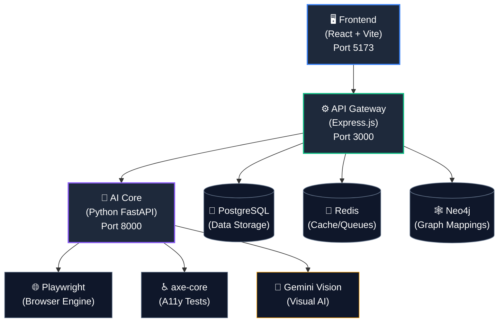
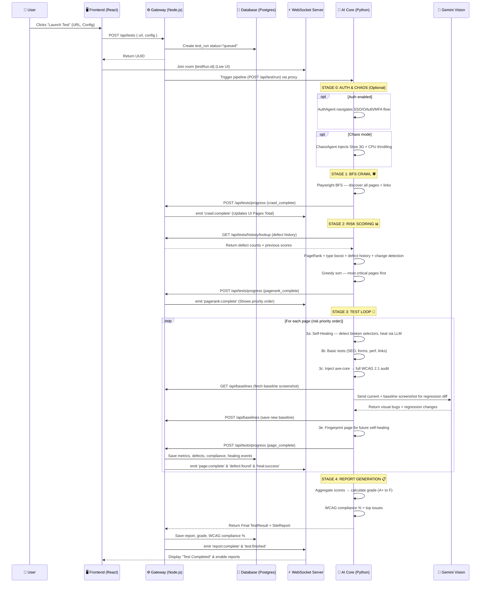

<div align="center">

  

  <h1>🚀 AutonomousQA</h1>

  <p>
    <strong>Zero-Touch • Zero-Script • Zero-Compromise</strong>
  </p>

  <p>
    <em>AI-powered, fully autonomous Quality Assurance engine that tests any web application — without a single line of test script.</em>
  </p>

  <p>
    <a href="https://github.com/rohith2157/BUGZERO/stargazers"></a>
    <a href="https://github.com/rohith2157/BUGZERO/network/members"></a>
    <a href="https://github.com/rohith2157/BUGZERO/issues"></a>
    <a href="https://github.com/rohith2157/BUGZERO/blob/main/LICENSE"></a>
    <a href="https://github.com/rohith2157/BUGZERO/pulls"></a>
  </p>

  <h4>
    <a href="#-what-is-autonomousqa">About</a> •
    <a href="#-the-6-ai-agents">Features</a> •
    <a href="#%EF%B8%8F-architecture">Architecture</a> •
    <a href="#%E2%9A%99%EF%B8%8F-system-workflow">Workflow</a> •
    <a href="#-quick-start">Quick Start</a> •
    <a href="#-contributing">Contributing</a>
  </h4>

</div>

---

## 🧠 What is AutonomousQA?

**AutonomousQA** is an AI-driven testing platform that autonomously crawls, analyzes, and tests any web application. Point it at a URL — it discovers every page, runs accessibility audits, performance checks, visual regression analysis, and functional tests — then reports defects with full evidence. **No scripts. No config. No babysitting.**

> 💡 **The Problem:** Writing and maintaining test scripts is slow, expensive, and fragile. Traditional QA can't keep pace with rapid development cycles, and critical bugs slip through because manual testing doesn't scale.

> ✨ **The Solution:** AutonomousQA deploys 6 specialized AI agents that behave like expert QA engineers — they explore your app intelligently, heal their own broken selectors, find issues humans miss, and deliver actionable reports in real time.

---

## 🤖 The 6 AI Agents

<div align="center">

| # | Agent | What It Does | How It Works |
|:-:|:---|:---|:---|
| ⚡ | **Self-Healing Tests** | Tests that auto-repair when UI changes. Zero maintenance. | Semantic fingerprinting of DOM elements → LLM-powered selector healing with confidence scoring → Full healing audit trail |
| 🛡️ | **Auth Navigator** | Logs into SSO, OAuth, MFA — automatically. | Computer vision + DOM analysis + Gemini reasoning to navigate any login flow → Stores strategies as reusable playbooks |
| 👁️ | **Visual Regression AI** | Semantic visual diff, not pixel noise. | Captures screenshots per page → Stores baselines → Gemini Vision compares current vs baseline → Classifies changes as cosmetic vs functional |
| 📊 | **Risk Prioritization** | AI decides what to test first based on risk. | PageRank graph analysis + page type boosting + defect history recidivism scoring + change detection → 4-factor risk model |
| ⚡ | **Performance Chaos** | Core Web Vitals on every page, every run. | Measures LCP, CLS, FID, TTFB via Playwright → Network throttling & CPU throttling (chaos mode) → Performance budget enforcement |
| ⚖️ | **Compliance Engine** | WCAG + GDPR audit on every test run. | axe-core WCAG 2.1 AA full scan → GDPR risk detection → Audit-ready compliance reports with remediation guidance |

</div>

### Self-Healing Tests — How It Works

```
Page Load → fingerprint_page() saves all interactive elements (buttons, links, inputs, forms)
  ↓
Next Run → detect_and_heal() compares current DOM vs saved fingerprints
  ↓
Broken selector found → Gemini LLM analyzes DOM + fingerprint → proposes new selector
  ↓
Validates selector exists → Records HealingEvent in DB with confidence score
  ↓
WebSocket → LiveTest shows "✅ Healed button_3: #old-btn → .new-btn (95%)"
```

### Visual Regression AI — How It Works

```
Run 1: Screenshot → Gemini analyzes for visual bugs → Save as baseline in DB
  ↓
Run 2: Screenshot → Fetch baseline → Gemini compares BOTH images side-by-side
  ↓
Changes classified: "Cosmetic: font-size changed" vs "Functional: button missing"
  ↓
Report page shows Visual Regression section with severity + confidence per change
```

### Risk Prioritization — 4-Factor Model

```
Stage 2: Fetch defect history from last 10 completed runs
  ↓
Risk Score = PageRank (link graph) + Type Boost (auth=+0.15, form=+0.12)
           + Defect History (up to +0.20 for recidivist pages)
           + Change Detection (up to +0.15 for score regressions)
  ↓
Pages sorted by combined risk → highest-risk tested first
```

---

## 🏗️ Architecture



| Service | Technology | Purpose |
|:---|:---|:---|
| **Frontend** | React 19, Vite 7, Framer Motion, Recharts | Interactive dashboard & real-time monitoring |
| **API Gateway** | Express.js, Prisma ORM, Socket.io, JWT | REST API, authentication, WebSocket relay |
| **AI Core** | Python FastAPI, Playwright, axe-core, Gemini | Autonomous crawling, testing, healing, and visual regression |
| **PostgreSQL** | v16 | Persistent storage (users, tests, defects, healing events, baselines) |
| **Redis** | v7 | Caching, session management, job queues |
| **Neo4j** | v5 | Graph-based page relationship mapping |

---

## ⚙️ System Workflow

Here's exactly what happens under the hood when you click **"Launch Test"**.



### Full Data Flow

```mermaid
flowchart LR
    Start(["User Request"]) --> Gateway["API Gateway"]
    Gateway --> Auth{"JWT Valid?"}
    Auth -- No --> Deny(["401 Unauthorized"])
    Auth -- Yes --> Route["tests route"]
    
    Route --> InitDB[("DB: test run created")]
    Route --> EventQueue(("Trigger Pipeline"))
    
    EventQueue --> AICore["AI Core Orchestrator"]
    AICore --> PW["Playwright Tool"]
    
    PW --> Crawler["Crawler Agent (BFS)"]
    Crawler --> Pages{"Discovered Pages + Links"}
    
    Pages --> History["Fetch Defect History"]
    History --> PR["Scheduler (PageRank + 4-Factor Risk)"]
    PR --> Sort["Greedy Sort (Priority)"]
    Sort --> WS1{{"WS: crawl:complete + pagerank:complete"}}
    
    Sort --> Loop["Test Loop (each page)"]
    Loop --> Heal["Self-Healing Agent"]
    Loop --> Basic["Tester Agent (SEO/Perf/Forms)"]
    Loop --> Axe["axe-core Tool (WCAG 2.1)"]
    Loop --> Vision["Vision Agent (Gemini + Regression)"]
    
    Heal --> Results["Page Results"]
    Basic --> Results
    Axe --> Results
    Vision --> Results
    Results --> WS2{{"WS: page:complete & defect:found & heal:success"}}
    
    WS2 --> Report["Report Agent"]
    Report --> Grade["Score + Grade (A+ to F)"]
    Grade --> FinDB[("Save report + baselines to Postgres")]
    FinDB --> WS3{{"WS: report:complete & test:finished"}}
```



---

## 🔍 Tech Stack Deep-Dive

AutonomousQA operates like a highly advanced human QA engineer. Here's how the core technologies work together:

### 1. Playwright (The "Eyes and Hands")
- **What it is:** A browser automation tool that launches real headless Chromium browsers.
- **Why we use it:** Unlike basic HTTP fetchers, Playwright executes JavaScript, renders React/Vue apps, paints CSS, and evaluates the actual Document Object Model (DOM) exactly as a human sees it.
- **How it works:** Python scripts inject evaluation code directly into the active browser page to measure Core Web Vitals (LCP, CLS, FID), check for accessibility violations, and perform visual heuristics.

### 2. Autonomous Crawling (The "Explorer")
- **What it is:** A Breadth-First Search (BFS) spider that maps the application.
- **How it works:** Starting from a seed URL, the crawler scans the DOM for valid `<a>` href links belonging to the same domain. It places these in a queue and visits them sequentially up to the configured `max_depth` and `max_pages`. This requires zero configuration from the user.

### 3. Self-Healing Agent (The "Mechanic") 🆕
- **What it is:** An AI-powered selector repair system that keeps tests running when UI changes.
- **How it works:**
  1. **Before testing:** `fingerprint_page()` captures structural fingerprints of all interactive elements (buttons, links, inputs, forms) — tag, text, ARIA labels, position, CSS classes.
  2. **On next run:** `detect_and_heal()` compares the current DOM against saved fingerprints. If a selector is broken, it sends the old fingerprint + current DOM to Gemini LLM.
  3. **Healing:** Gemini proposes a new CSS selector with confidence score. The agent validates it works on the live page before accepting.
  4. **Audit trail:** Every healing event is persisted in the `healing_events` database table with original selector, healed selector, and confidence.

### 4. Visual Regression Engine (The "Designer's Eye") 🆕
- **What it is:** A Gemini Vision-powered visual comparison system that detects meaningful UI changes.
- **How it works:**
  1. **Run 1:** Takes a screenshot of each page, sends to Gemini for single-image visual bug detection, then saves the screenshot as a baseline in `screenshot_baselines` table.
  2. **Run 2+:** Fetches the baseline, sends BOTH images to Gemini with a regression-focused prompt. Gemini classifies each change as:
     - **Cosmetic:** font, color, spacing, border changes (informational)
     - **Functional:** layout broken, element missing, text changed (actionable)
  3. **Baselines auto-update** after each run — always comparing against the latest known-good state.

### 5. Risk Prioritization (The "Strategist") 🆕
- **What it is:** A multi-factor scoring system that determines which pages to test first.
- **4 risk factors:**
  1. **PageRank** (networkx) — structural importance from the link graph
  2. **Page Type Boost** — auth pages (+0.15), forms (+0.12), dashboards (+0.08)
  3. **Defect History** — pages with previous defects get up to +0.20 boost (recidivism)
  4. **Change Detection** — pages whose scores dropped below 70 get up to +0.15 boost

### 6. WebSockets / Socket.io (The "Live Broadcaster")
- **Why we use it:** Full autonomous testing can take 5-20 minutes. Polling is inefficient. WebSockets keep a permanent two-way "phone line" open between the browser and the server.
- **How it works:**
  1. The React frontend subscribes to a specific `testRunId` room.
  2. The Python AI finishes testing a single page and POSTs the result to the Express Gateway.
  3. The Gateway saves the page to PostgreSQL and instantly broadcasts that data packet over the active WebSocket.
  4. The React UI instantly receives the data and animates it onto the screen without a page refresh.

---

## 🚀 Quick Start

### 📋 Prerequisites

- **Node.js** 20+
- **Python** 3.11+
- **Docker & Docker Compose** (Latest)

### 1️⃣ Clone the repository

```bash
git clone https://github.com/rohith2157/BUGZERO.git
cd BUGZERO
```

### 2️⃣ Start infrastructure

```bash
docker-compose up -d
```

### 3️⃣ Setup API Gateway

```bash
cd gateway
npm install
cp .env.example .env          # configure your environment
npx prisma generate
npx prisma db push
node prisma/seed.js            # seed demo data
npm run dev
```

### 4️⃣ Setup AI Core

```bash
cd ai-core
python -m venv venv
# Linux/macOS: source venv/bin/activate
# Windows:     venv\Scripts\activate
pip install -r requirements.txt
playwright install chromium
cp .env.example .env
python main.py
```

### 5️⃣ Setup Frontend

```bash
cd autonomousqa-frontend
npm install
npm run dev
```

### 6️⃣ Open the app

| Service | URL |
|:---|:---|
| **Frontend** | [http://localhost:5173](http://localhost:5173) |
| **API Gateway** | [http://localhost:3000](http://localhost:3000) |
| **AI Core Docs** | [http://localhost:8000/docs](http://localhost:8000/docs) |
| **Neo4j Browser** | [http://localhost:7474](http://localhost:7474) |
| **Prisma Studio** | Run `cd gateway && npx prisma studio` |

> 🔑 **Default Login:**
> Email: `rohith@autonomousqa.io` | Password: `password123`

---

## 📂 Project Structure

```text
BUGZERO/
├── autonomousqa-frontend/         # React + Vite frontend
│   ├── src/
│   │   ├── components/            # Reusable UI components
│   │   │   └── ui/                # Design system primitives
│   │   ├── pages/                 # Route-level page components
│   │   │   ├── Landing.jsx        # Marketing landing page
│   │   │   ├── UseCases.jsx       # 6 AI Agents deep-dive
│   │   │   ├── Dashboard.jsx      # Test history & analytics
│   │   │   ├── NewTest.jsx        # Test configuration launcher
│   │   │   ├── LiveTest.jsx       # Real-time test monitoring + self-healing log
│   │   │   ├── Report.jsx         # Full test report + visual regression section
│   │   │   ├── Compliance.jsx     # WCAG compliance details
│   │   │   └── Performance.jsx    # Core Web Vitals dashboard
│   │   ├── hooks/                 # Custom React hooks (WebSocket, etc.)
│   │   ├── lib/                   # API client & utilities
│   │   ├── store/                 # Zustand state management
│   │   └── data/                  # Mock data (development fallback)
│   ├── index.html
│   └── vite.config.js
│
├── gateway/                       # Express.js API Gateway
│   ├── src/
│   │   ├── routes/
│   │   │   ├── tests.js           # Test CRUD + progress + healing events + history
│   │   │   ├── baselines.js       # 🆕 Visual regression baseline CRUD
│   │   │   ├── auth.js            # JWT authentication
│   │   │   ├── playbooks.js       # Test playbook management
│   │   │   └── settings.js        # User/team/API key settings
│   │   ├── middleware/            # Auth, validation, rate limiting
│   │   └── services/              # Business logic & WebSocket
│   ├── prisma/
│   │   ├── schema.prisma          # Database schema (13 models)
│   │   └── seed.js                # Seed data script
│   └── .env.example
│
├── ai-core/                       # Python FastAPI AI Engine
│   ├── agents/
│   │   ├── crawler.py             # BFS crawler agent
│   │   ├── tester.py              # Page testing agent
│   │   ├── self_healing_agent.py  # 🆕 Fingerprinting + LLM-powered healing
│   │   ├── vision_agent.py        # Gemini Vision + visual regression
│   │   ├── scheduler.py           # PageRank + 4-factor risk scoring
│   │   ├── auth_agent.py          # SSO/OAuth/MFA navigator
│   │   ├── chaos_agent.py         # Network/CPU throttling
│   │   └── report_agent.py        # Site report generator
│   ├── tools/
│   │   ├── playwright_tool.py     # Browser automation + screenshots + DOM access
│   │   └── axe_tool.py            # axe-core WCAG 2.1 scanner
│   ├── models/
│   │   └── schemas.py             # Pydantic models (HealingEvent, VisualRegression, etc.)
│   ├── orchestrator.py            # Multi-stage pipeline coordinator
│   ├── config.py                  # Settings (Gemini API key, etc.)
│   ├── main.py                    # FastAPI entrypoint
│   └── requirements.txt
│
├── documentation/                 # 📚 All project documentation
│   ├── AUTONOMOUSQA_DOCUMENTATION.docx
│   ├── AutonomousQA_Full_Roadmap.docx
│   ├── BROWSERS_AND_CRAWL_DEPTHS.md
│   └── SYSTEM_WORKFLOW.md
│
├── docker-compose.yml             # PostgreSQL + Redis + Neo4j
├── package.json                   # Root workspace scripts
├── CONTRIBUTING.md                # Contribution guidelines
├── CODE_OF_CONDUCT.md             # Community standards
├── SECURITY.md                    # Security policy
└── LICENSE                        # MIT License
```

---

## 📡 API Reference

<details>
<summary><strong>🔐 Authentication</strong></summary>

| Method | Endpoint | Description |
|:---|:---|:---|
| `POST` | `/api/auth/register` | Register a new user |
| `POST` | `/api/auth/login` | Login — returns JWT |
| `GET` | `/api/auth/me` | Get current user profile |
| `POST` | `/api/auth/refresh` | Refresh access token |

</details>

<details>
<summary><strong>🧪 Test Runs</strong></summary>

| Method | Endpoint | Description |
|:---|:---|:---|
| `POST` | `/api/tests` | Start a new autonomous test run |
| `GET` | `/api/tests` | List all test runs |
| `GET` | `/api/tests/:id` | Get test run details |
| `DELETE` | `/api/tests/:id` | Cancel a running test |
| `GET` | `/api/tests/:id/pages` | Get page-level results |
| `GET` | `/api/tests/:id/compliance` | Compliance report |
| `GET` | `/api/tests/:id/performance` | Performance report |
| `GET` | `/api/tests/:id/healing` | 🆕 Self-healing events for a run |
| `GET` | `/api/tests/history/lookup` | 🆕 Defect history for risk prioritization |

</details>

<details>
<summary><strong>📸 Visual Regression Baselines</strong></summary>

| Method | Endpoint | Description |
|:---|:---|:---|
| `GET` | `/api/baselines?url=&orgId=` | 🆕 Fetch baseline screenshot for a URL |
| `POST` | `/api/baselines` | 🆕 Save/update baseline screenshot |

</details>

<details>
<summary><strong>📋 Playbooks</strong></summary>

| Method | Endpoint | Description |
|:---|:---|:---|
| `GET` | `/api/playbooks` | List saved playbooks |
| `POST` | `/api/playbooks` | Create a playbook |
| `PUT` | `/api/playbooks/:id` | Update a playbook |
| `DELETE` | `/api/playbooks/:id` | Delete a playbook |

</details>

<details>
<summary><strong>⚙️ Settings</strong></summary>

| Method | Endpoint | Description |
|:---|:---|:---|
| `GET` | `/api/settings/team` | Get team members |
| `PUT` | `/api/settings/profile` | Update user profile |
| `GET` | `/api/settings/api-keys` | List API keys |
| `POST` | `/api/settings/api-keys` | Generate new API key |
| `DELETE` | `/api/settings/api-keys/:id` | Revoke an API key |

</details>

### WebSocket Events

| Event | Direction | Description |
|:---|:---|:---|
| `test:started` | Server → Client | Test run initiated |
| `page:discovered` | Server → Client | New page found during crawl |
| `page:complete` | Server → Client | Page testing finished |
| `defect:found` | Server → Client | Defect detected in real time |
| `heal:success` | Server → Client | 🆕 Self-healing selector repair |
| `test:complete` | Server → Client | Full test run finished |
| `test:cancel` | Client → Server | Request to cancel a test |

---

## 🗄️ Database Schema

The platform uses **13 Prisma models** across PostgreSQL:

| Model | Purpose |
|:---|:---|
| `User` | Authentication & profile |
| `Organization` | Team management |
| `TestRun` | Test execution records |
| `Page` | Discovered pages with scores |
| `Defect` | Detected bugs with severity |
| `ComplianceResult` | WCAG/GDPR violations |
| `PerformanceMetric` | Core Web Vitals per page |
| `HealingEvent` | 🆕 Self-healing audit trail (original → healed selector + confidence) |
| `ScreenshotBaseline` | 🆕 Visual regression baseline screenshots per URL |
| `AuthPlaybook` | Saved authentication strategies |
| `ApiKey` | API key management |
| `NotificationPreference` | Notification settings |
| `UserActivity` | Activity tracking |

---

## 🗺️ Roadmap

- [x] Autonomous web crawler with Playwright
- [x] Accessibility auditing (axe-core WCAG 2.1 AA)
- [x] Real-time dashboard with WebSocket
- [x] JWT authentication & team management
- [x] Playbook save/replay system
- [x] Core Web Vitals performance monitoring
- [x] Gemini Vision AI visual bug detection
- [x] 🆕 Self-healing tests with semantic fingerprinting
- [x] 🆕 Visual regression AI with baseline comparison
- [x] 🆕 Risk prioritization with defect history + change detection
- [x] 🆕 Self-healing audit trail (DB + frontend UI)
- [ ] Natural language test generation (LangChain + OpenAI)
- [ ] CI/CD pipeline integration (GitHub Actions, Jenkins)
- [ ] PDF/HTML report export
- [ ] Multi-browser support (Firefox, WebKit)
- [ ] Scheduled recurring test runs
- [ ] Slack / Teams notification integration

---

## 🤝 Contributing

We love contributions! Whether it's fixing a typo or building a new AI agent, every bit helps.

1. **Fork** the repository
2. **Create** your feature branch (`git checkout -b feat/amazing-feature`)
3. **Commit** your changes (`git commit -m 'feat: add amazing feature'`)
4. **Push** to the branch (`git push origin feat/amazing-feature`)
5. **Open** a Pull Request

Please read our [Contributing Guide](./CONTRIBUTING.md) and [Code of Conduct](./CODE_OF_CONDUCT.md) before getting started.

---

## 🛡️ Security

Found a vulnerability? Please report it responsibly. See our [Security Policy](./SECURITY.md) for details.

---

## 📄 License

This project is licensed under the **MIT License** — see the [LICENSE](./LICENSE) file for details.

---

## 🙏 Acknowledgments

- **[Playwright](https://playwright.dev/)** — Browser automation
- **[axe-core](https://github.com/dequelabs/axe-core)** — Accessibility testing engine
- **[Google Gemini](https://ai.google.dev/)** — Vision AI & LLM reasoning
- **[Prisma](https://www.prisma.io/)** — Next-generation ORM
- **[Framer Motion](https://www.framer.com/motion/)** — Animation library
- **[networkx](https://networkx.org/)** — PageRank graph analysis

---

<div align="center">
  <p><strong>Built with ❤️ by <a href="https://github.com/rohith2157">Rohith</a></strong></p>
  <p><sub>If AutonomousQA helped you, consider giving it a ⭐</sub></p>
</div>
