<div align="center">

# 🚀 BUGZERO (AutonomousQA v3.1 — God-Mode)

---

## 🧠 What is AutonomousQA?

<div align="center">
  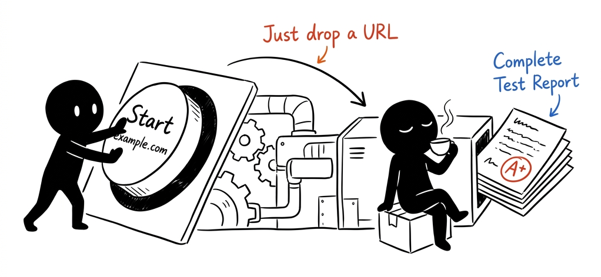
  <br>
  <em>The Zero-Touch Promise: Point it at a URL, and it delivers a complete test report.</em>
</div>
<br>

**AutonomousQA** is an AI-driven testing platform that autonomously crawls, analyzes, and tests any web application. Point it at a URL — it discovers every page, runs accessibility audits, performance checks, visual regression analysis, and functional tests — then reports defects with full evidence. **No scripts. No config. No babysitting.**

> 💡 **The Problem:** Writing and maintaining test scripts is slow, expensive, and fragile. Traditional QA can't keep pace with rapid development cycles, and critical bugs slip through because manual testing doesn't scale.

> ✨ **The Solution:** AutonomousQA deploys 6 specialized AI agents that behave like expert QA engineers — they explore your app intelligently, heal their own broken selectors, find issues humans miss, and deliver actionable reports in real time.

---

## 🌟 The Evolution: From Normal to Extraordinary

We recently transitioned AutonomousQA from a "Normal" AI framework (dependent on expensive LLMs) to an "Extraordinary" **100% Pure Algorithmic Engine**. We ripped out the Gemini Vision and Text LLMs and replaced them with mathematically provable deterministic logic.

**Why?** Because a testing framework must be 100% reliable, offline, and free to run.

| Feature                     | "Normal" AI Approach (Old)                           | "Extraordinary" Algorithmic Approach (New)                                                                 |
| :-------------------------- | :--------------------------------------------------- | :--------------------------------------------------------------------------------------------------------- |
| **Self-Healing**      | Sends DOM to LLM. Slow (4000ms), hallucinates.       | **Fuzzy DOM Scoring**. Uses Levenshtein distance and Pythagorean spatial decay. Heals in 15ms.       |
| **Visual Regression** | Asks Gemini "Does this look broken?". Expensive.     | **SSIM & Bounding Boxes**. Uses `ImageChops` with Gaussian Blurring to mathematically diff pixels. |
| **Cost**              | High ($$ per API token on every test run)            | **$0.00 (Completely Free & Offline)**                                                                |
| **Determinism**       | Probabilistic (May change its mind on the same page) | **100% Deterministic** (Math never lies)                                                             |
| **Speed**             | Network I/O Bound (Slow API calls)                   | **CPU Bound** (Microsecond execution)                                                                |

[Read the full Algorithmic Architectural Roadmap here!](file:///c:/testproject/documentation/100percent_algo.md)

---

## 🤖 The 6 AI Agents

<div align="center">

### 🧮 Self-Healing Tests — The Fuzzy Algorithmic Engine

We completely removed Large Language Models (LLMs) from the healing process to guarantee 100% mathematical determinism. When a UI element changes its class, ID, or text, a traditional test script fails. Our algorithmic engine heals it instantly using a multi-variable heuristic scoring system.

**1. The Historical Fingerprint**
Before any test, the system saves a lightweight JSON fingerprint of all interactive elements:
- `tagName` (e.g., `button`)
- `textContent` (e.g., "Submit Order")
- `attributes` (e.g., classes, IDs, names)
- `metrics` (2D spatial coordinates via `getBoundingClientRect()`)

**2. The Mathematical Scoring Matrix**
When a selector breaks, the engine scans the current DOM and calculates a score `S(E, F)` for every element `E` against the historical fingerprint `F`:
- **Tag Match**: Exact match grants +20 points.
- **Text Similarity (Levenshtein Distance)**: We calculate the minimum number of single-character edits required to change the old text into the new text. This catches subtle changes (like "Log in" to "Login"). Grants up to +35 points.
- **Attribute Intersection**: We split CSS classes into sets and calculate the overlap. Grants up to +25 points.
- **Spatial Proximity (Pythagorean Decay)**: If the text and classes are heavily obfuscated, spatial location is the ultimate fallback. We calculate the Pythagorean distance between the old element and the new element. We apply an exponential decay function so elements perfectly in place get max points (+20), and elements further away rapidly lose points.

If the highest-scoring element exceeds a strict threshold (e.g., > 55/100), the system dynamically generates a new CSS selector, clicks the button, and records a `HealingEvent` in the database.

```text
  OLD: #checkout-form > button.btn-primary     ← BROKEN ❌      
  NEW: .checkout-container > .cta-button        ← HEALED ✅      
  ALGO SCORE: 88.5/100 (Levenshtein text match + perfect spatial match)              
```

### 👁️ Visual Regression — SSIM and Pixel Math

Just like self-healing, we ripped out the "Vision LLMs" and replaced them with raw pixel mathematics using Python's `Pillow` library.

**The Problem with MSE (Mean Squared Error)**
Traditional visual regression compares absolute pixel differences. If a browser updates its font anti-aliasing engine, every text pixel shifts by a microscopic hex value. MSE will fail the test, causing a nightmare of "false positive" noise for QA teams.

**Our Solution: Blurred Image Subtraction**
1. **Gaussian Blurring:** We apply a low-radius Gaussian blur to both the baseline and current screenshots. This intentionally destroys 1-pixel micro-variations (like anti-aliasing) while preserving macro-structures (buttons, layout, spacing).
2. **Difference Subtraction:** Using `Pillow.ImageChops.difference()`, we mathematically subtract the pixel values of the baseline from the current image. The resulting image is completely black where the UI matches, and highlighted where it differs.
3. **Statistical Variance:** We calculate the sum of all pixel values in the difference image. By dividing this by the maximum possible difference (Width × Height × 255 × 3 channels), we obtain a precise "Drift Percentage".

If the Drift Percentage exceeds a predefined noise threshold (e.g., 0.5%), the test fails with a functional visual regression. No AI hallucination, just pure structural validation.

### Risk Prioritization — 4-Factor Model

```
Stage 2: Fetch defect history from last 10 completed runs
  ↓
Risk Score = PageRank (link graph) + Type Boost (auth=+0.15, form=+0.12)
           + Defect History (up to +0.20 for recidivist pages)
           + Change Detection (up to +0.15 for score regressions)
  ↓
Pages sorted by combined risk → highest-risk tested first
```

---

## 🏗️ Architecture

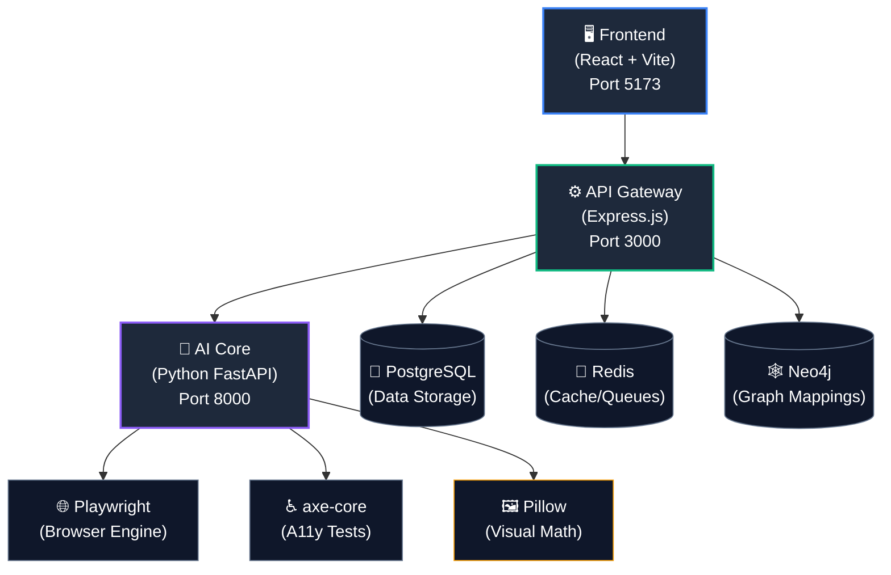

| Service               | Technology                                   | Purpose                                                               |
| :-------------------- | :------------------------------------------- | :-------------------------------------------------------------------- |
| **Frontend**    | React 19, Vite 7, Framer Motion, Recharts    | Interactive dashboard & real-time monitoring                          |
| **API Gateway** | Express.js, Prisma ORM, Socket.io, JWT       | REST API, authentication, WebSocket relay                             |
| **AI Core**     | Python FastAPI, Playwright, axe-core, Pillow | Autonomous crawling, testing, healing, and visual regression          |
| **PostgreSQL**  | v16                                          | Persistent storage (users, tests, defects, healing events, baselines) |
| **Redis**       | v7                                           | Caching, session management, job queues                               |
| **Neo4j**       | v5                                           | Graph-based page relationship mapping                                 |

---

## ⚙️ System Workflow

Here's exactly what happens under the hood when you click **"Launch Test"**.

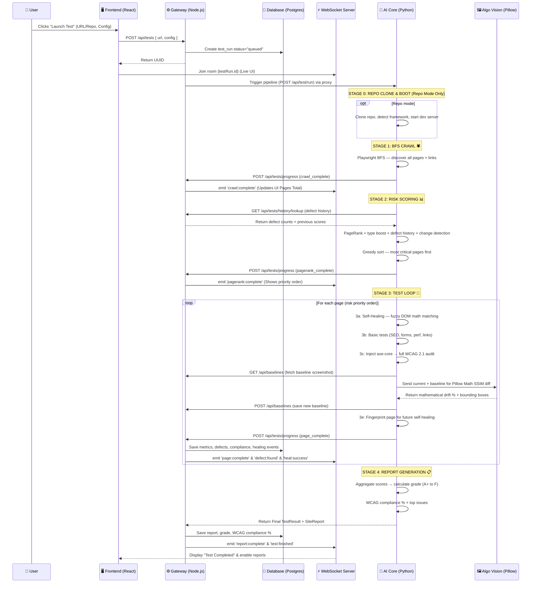

### Full Data Flow


---

## 🔍 Tech Stack Deep-Dive

AutonomousQA operates like a highly advanced human QA engineer. Here's how the core technologies work together:

### 1. Playwright (The "Eyes and Hands")

- **What it is:** A browser automation tool that launches real headless Chromium browsers.
- **Why we use it:** Unlike basic HTTP fetchers, Playwright executes JavaScript, renders React/Vue apps, paints CSS, and evaluates the actual Document Object Model (DOM) exactly as a human sees it.
- **How it works:** Python scripts inject evaluation code directly into the active browser page to measure Core Web Vitals (LCP, CLS, FID), check for accessibility violations, and perform visual heuristics.

### 2. Autonomous Crawling (The "Explorer")

<div align="center">
  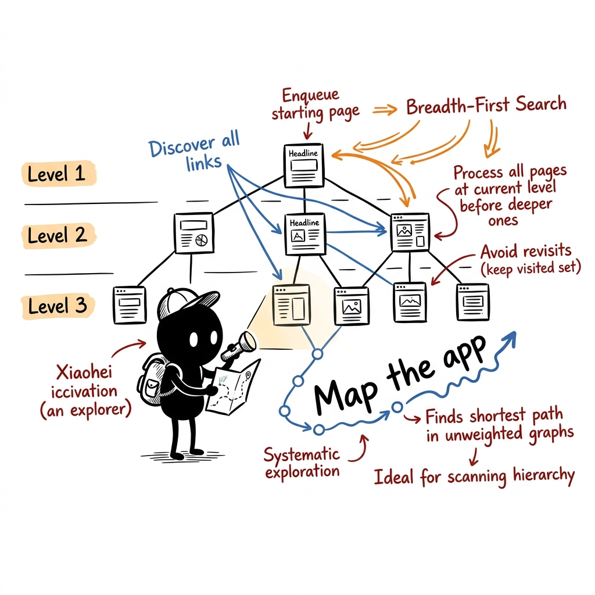
  <br>
  <em>BFS Crawler: Discovering and mapping all pages level-by-level.</em>
</div>
<br>

- **What it is:** A Breadth-First Search (BFS) spider that maps the application.
- **How it works:** Starting from a seed URL, the crawler scans the DOM for valid `<a>` href links belonging to the same domain. It places these in a queue and visits them sequentially up to the configured `max_depth` and `max_pages`. This requires zero configuration from the user.

#### 🧭 Crawl Strategy Comparison

There are several approaches to crawl a website. Here's how they differ and why we chose BFS:

```
  EXAMPLE SITE MAP                      
                                         
            🏠 Homepage                  
           /     |     \                 
        📄About 📄Blog  📄Dash          
                 |        |    \         
              📄Post1  📄Settings 📄Analytics
                          |              
                       📄Profile
```

---

**① BFS — Breadth-First Search  ✅ WHAT WE USE**

```
  Visit order:  Level by level (wide first, then deep)

  Step 1 →  🏠 Homepage
  Step 2 →  📄 About        (Level 1)
  Step 3 →  📄 Blog         (Level 1)
  Step 4 →  📄 Dashboard    (Level 1)
  Step 5 →  📄 Post1        (Level 2)
  Step 6 →  📄 Settings     (Level 2)
  Step 7 →  📄 Analytics    (Level 2)
  Step 8 →  📄 Profile      (Level 3)

  ┌─────────────────────────────────────────────────┐
  │  Uses: FIFO Queue (First In, First Out)         │
  │                                                 │
  │  Queue: [Homepage]                              │
  │         → visit Homepage → enqueue children     │
  │  Queue: [About, Blog, Dashboard]                │
  │         → visit About → visit Blog → ...        │
  │  Queue: [Post1, Settings, Analytics]            │
  │         → visit all Level 2 ...                 │
  │                                                 │
  │  ✅ Finds important top-level pages FIRST       │
  │  ✅ Natural depth control (shallow/standard)    │
  │  ✅ Guaranteed shortest path to every page      │
  │  ⚠️ Sequential — one page at a time            │
  └─────────────────────────────────────────────────┘
```

---

**② DFS — Depth-First Search**

```
  Visit order:  Dive deep into one branch, then backtrack

  Step 1 →  🏠 Homepage
  Step 2 →  📄 About        ← dead end, backtrack
  Step 3 →  📄 Blog
  Step 4 →  📄 Post1        ← dead end, backtrack
  Step 5 →  📄 Dashboard
  Step 6 →  📄 Settings
  Step 7 →  📄 Profile      ← deep! finally backtrack
  Step 8 →  📄 Analytics

  ┌─────────────────────────────────────────────────┐
  │  Uses: LIFO Stack (Last In, First Out)          │
  │                                                 │
  │  Stack: [Homepage]                              │
  │         → visit Homepage → push children        │
  │  Stack: [About, Blog, Dashboard]                │
  │         → pop Dashboard → push its children     │
  │  Stack: [About, Blog, Settings, Analytics]      │
  │                                                 │
  │  ✅ Low memory usage                            │
  │  ✅ Good for finding deep-nested pages          │
  │  ❌ Can get lost in deep rabbit holes           │
  │  ❌ Misses breadth of site if max_pages hit     │
  └─────────────────────────────────────────────────┘
```

---

**③ Priority Queue — Best-First Search**

```
  Visit order:  Highest-priority (most "interesting") pages first

  Step 1 →  🏠 Homepage        (score: 100)
  Step 2 →  📄 Dashboard       (score: 90  — has forms!)
  Step 3 →  📄 Settings        (score: 85  — user inputs)
  Step 4 →  📄 Profile         (score: 80  — auth page)
  Step 5 →  📄 Blog            (score: 40  — static content)
  Step 6 →  📄 About           (score: 30  — low risk)
  Step 7 →  📄 Post1           (score: 20)
  Step 8 →  📄 Analytics       (score: 15)

  ┌─────────────────────────────────────────────────┐
  │  Uses: Priority Queue (highest score first)     │
  │                                                 │
  │  Each URL gets a score based on:                │
  │  • Has forms/inputs        → +40 points        │
  │  • Login/auth page         → +30 points        │
  │  • Dynamic route (/dashboard) → +20 points     │
  │  • Static content (/blog)  → +5 points         │
  │                                                 │
  │  ✅ Tests bug-prone pages first                 │
  │  ✅ Best use of limited max_pages budget        │
  │  ⚠️ Needs heuristic scoring logic              │
  │  ⚠️ More complex implementation                │
  └─────────────────────────────────────────────────┘
```

---

**④ Concurrent BFS — Parallel Breadth-First**

```
  Visit order:  Same as BFS, but multiple pages at once

  Step 1   →  🏠 Homepage
  Step 2-4 →  📄 About + 📄 Blog + 📄 Dashboard   ← parallel!
  Step 5-7 →  📄 Post1 + 📄 Settings + 📄 Analytics ← parallel!
  Step 8   →  📄 Profile

  ┌─────────────────────────────────────────────────┐
  │  Uses: FIFO Queue + Semaphore (N workers)       │
  │                                                 │
  │  Worker 1: About ──→ Post1 ──→ Profile          │
  │  Worker 2: Blog ───→ Settings                   │
  │  Worker 3: Dashboard → Analytics                │
  │                                                 │
  │  ✅ 3-5x faster than sequential BFS             │
  │  ✅ Same level-by-level coverage as BFS         │
  │  ✅ Semaphore prevents server overload          │
  │  ⚠️ Needs careful concurrency management       │
  │  ⚠️ Higher memory (multiple browser pages)     │
  └─────────────────────────────────────────────────┘
```

---

#### 📊 Strategy Comparison Matrix

```
                    BFS ✅        DFS          PRIORITY      CONCURRENT
                    (Current)                  QUEUE         BFS
  ─────────────────────────────────────────────────────────────────────
  Data Structure    FIFO Queue    LIFO Stack   Heap/PQ       Queue+Sema
  Visit Order       Level-by-     Branch-by-   Score-based   Level-by-
                    level         branch                     level
  Speed             ██░░░░        ██░░░░       ██░░░░        █████░
                    Moderate      Moderate     Moderate      Fast
  Coverage          █████░        ███░░░       ████░░        █████░
                    Excellent     Poor breadth Smart focus   Excellent
  Memory            ███░░░        █░░░░░       ███░░░        ████░░
                    Moderate      Very Low     Moderate      Higher
  Complexity        █░░░░░        █░░░░░       ████░░        ███░░░
                    Simple        Simple       Complex       Moderate
  Depth Control     ✅ Natural    ❌ Hard       ⚠️ Manual     ✅ Natural
  Best For          General       Deep-page    Limited       Large
                    crawling      hunting      page budgets  site audits
  ─────────────────────────────────────────────────────────────────────
```

> 🟢 **Current Implementation:** BugZero uses **BFS (Breadth-First Search)** with an `asyncio.Queue`. This ensures top-level pages (homepage, navigation links, dashboards) are tested first, matching our Shallow → Standard → Deep crawl depth model perfectly.

### 3. The DOM (Document Object Model) Analysis

<div align="center">
  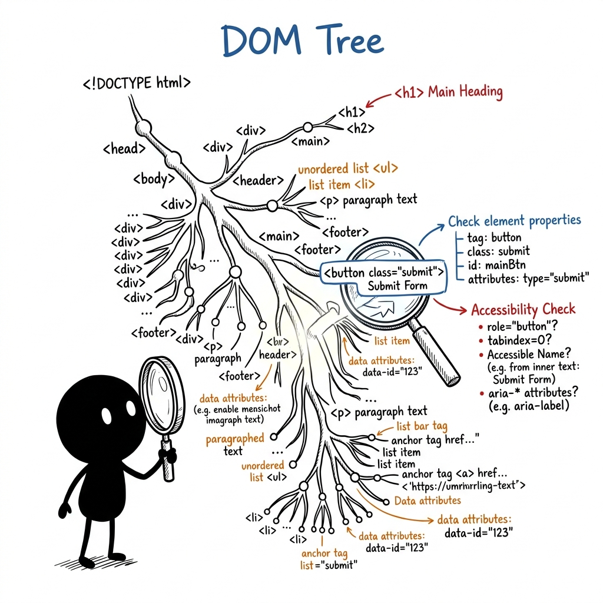
  <br>
  <em>DOM Analysis: Inspecting the exact structure and accessibility of the page.</em>
</div>
<br>

The DOM is the tree-like structure the browser builds from HTML. Our AI uses the DOM as its primary source of truth to detect defects:

- **Accessibility:** Scans the DOM tree for `` tags missing `alt` attributes, or `<input>` fields detached from `<label>` elements.
- **SEO & Structure:** Evaluates the heading hierarchy (e.g., checking for exactly one `<h1>` node).
- **UI Integrity:** Uses `getComputedStyle(element)` to ask the browser engine the exact painted color of text vs background to calculate real mathematical contrast ratios.

### 4. Self-Healing Agent (The "Mechanic") 🆕

<div align="center">
  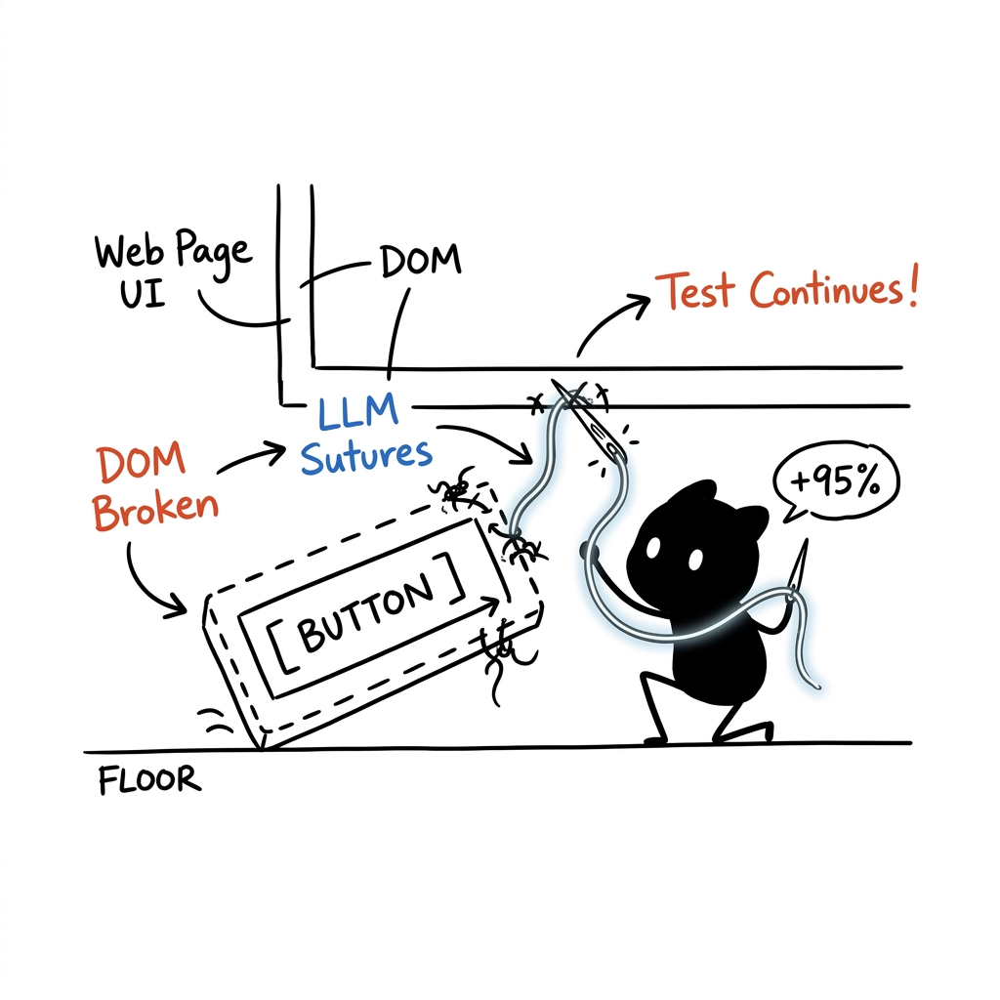
  <br>
  <em>Self-Healing: Using LLMs to dynamically stitch broken UI selectors back together.</em>
</div>
<br>

An AI-powered selector repair system that keeps tests running when UI changes.

```mermaid
flowchart TD
    subgraph "Stage 3a — Before Each Page Test"
        A["🌐 Navigate to page"] --> B["📋 Load saved fingerprints\nfrom previous run"]
        B --> C{"Any interactive\nelements changed?"}
        C -- No --> D["✅ All selectors healthy"]
        C -- Yes --> E["🔍 identify broken\nselectors in DOM"]
        E --> F["🤖 Send to Gemini LLM:\nold fingerprint + current DOM"]
        F --> G["💡 Gemini proposes\nnew CSS selector"]
        G --> H{"Validate selector\non live page?"}
        H -- Fails --> I["⚠️ Log as unhealed"]
        H -- Works --> J["✅ Accept healed selector\nconfidence: 0.95"]
        J --> K["💾 Save HealingEvent to DB\noriginal → healed + confidence"]
        K --> L["📡 WebSocket: heal:success"]
    end
  
    subgraph "Stage 3e — After Each Page Test"
        M["🔍 fingerprint_page()"] --> N["📸 Capture all buttons,\nlinks, inputs, forms"]
        N --> O["💾 Store fingerprints\nfor next run"]
    end

    style A fill:#1E293B,stroke:#3B82F6,color:#fff
    style F fill:#1E293B,stroke:#F59E0B,color:#fff
    style J fill:#0F172A,stroke:#10B981,color:#fff
    style K fill:#0F172A,stroke:#A78BFA,color:#fff
```

**How it works internally:**

```
  ┌─────────────────────────────────────────────────────────────────┐
  │  FINGERPRINT STRUCTURE (per interactive element)                │
  │─────────────────────────────────────────────────────────────────│
  │                                                                 │
  │  {                                                              │
  │    "element_id": "btn_submit_3",                                │
  │    "tagName": "button",                                         │
  │    "textContent": "Submit Order",                               │
  │    "ariaLabel": "Submit your order",                            │
  │    "className": "btn-primary cta-main",                         │
  │    "position": { "x": 450, "y": 720 },                         │
  │    "nearbyText": ["Order Summary", "$49.99", "Free Shipping"],  │
  │    "selector": "#checkout-form > button.btn-primary"            │
  │  }                                                              │
  │                                                                 │
  │  When UI changes:                                               │
  │  ─────────────────                                              │
  │  OLD: #checkout-form > button.btn-primary     ← BROKEN ❌      │
  │  NEW: .checkout-container > .cta-button        ← HEALED ✅      │
  │  CONFIDENCE: 0.92 (high — text + position matched)              │
  │                                                                 │
  └─────────────────────────────────────────────────────────────────┘
```

### 5. Visual Regression Engine (The "Designer's Eye") 🆕

<div align="center">
  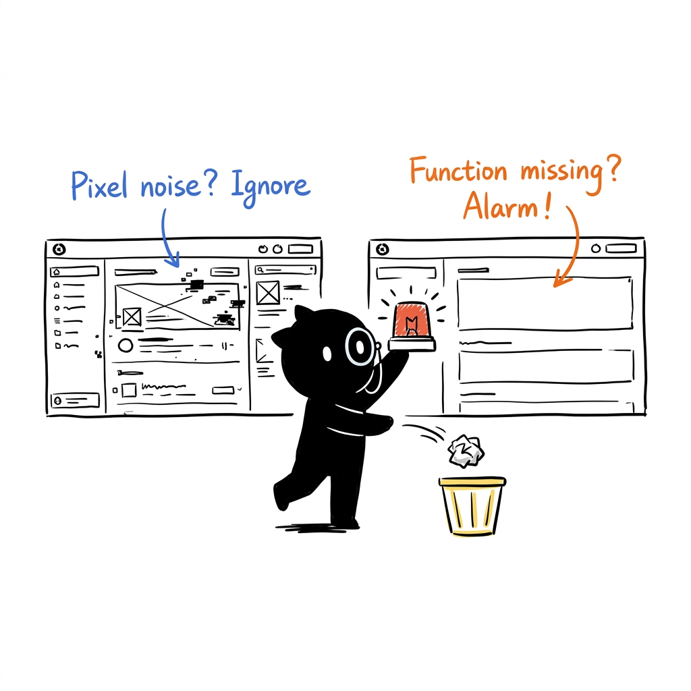
  <br>
  <em>Visual Regression: Ignoring cosmetic noise while catching critical functional UI changes using Pillow Math.</em>
</div>
<br>

A 100% deterministic pixel-math comparison system that detects meaningful UI changes without LLMs.

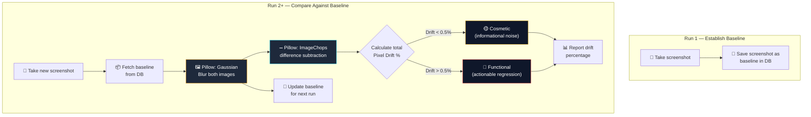

**Visual diff classification examples:**

```
  ┌────────────────────────────────────────────────────────────────┐
  │  PILLOW MATH — REGRESSION CLASSIFICATION                        │
  │────────────────────────────────────────────────────────────────│
  │                                                                │
  │  🟡 COSMETIC (informational — no action needed)               │
  │  ──────────────────────────────────────────────                │
  │  • Font anti-aliasing engine changes in browser               │
  │  • 1-pixel micro-variations from rendering jitter             │
  │  • Sub-pixel rounding differences across OS                   │
  │  (Drift is caught by blur threshold < 0.5%)                   │
  │                                                                │
  │  🔴 FUNCTIONAL (actionable — must fix)                        │
  │  ──────────────────────────────────────────────                │
  │  • Submit button missing from checkout form                   │
  │  • Navigation menu items overlapping on mobile                │
  │  • Login form fields not visible (zero height)                │
  │  • Price display structurally shifted                         │
  │  (Drift exceeds blur threshold > 0.5%)                        │
  │                                                                │
  │  Drift Metric: Exact % difference calculation                 │
  │                                                                │
  └────────────────────────────────────────────────────────────────┘
```

### 6. Risk Prioritization (The "Strategist") 🆕

<div align="center">
  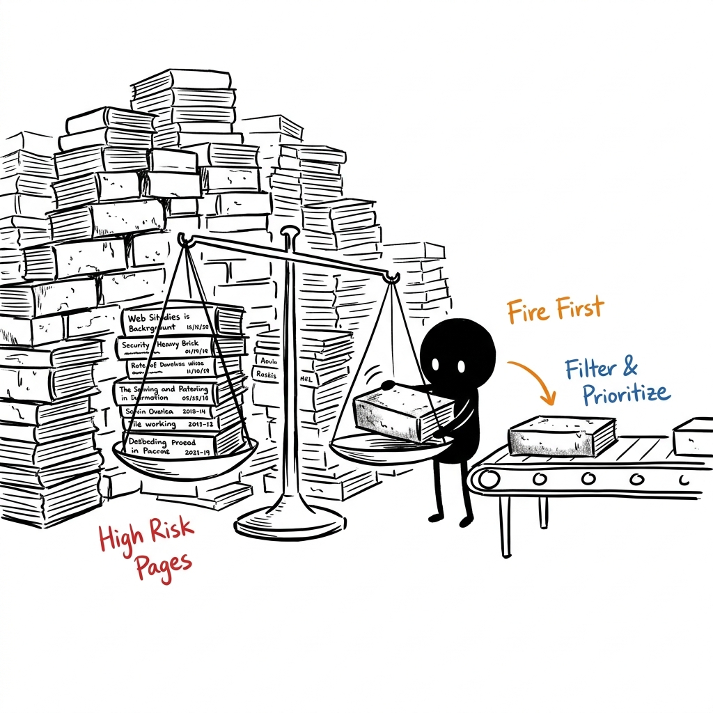
  <br>
  <em>Risk Prioritization: Weighing forms and defect history to test high-risk pages first.</em>
</div>
<br>

A multi-factor scoring system that determines which pages to test first.

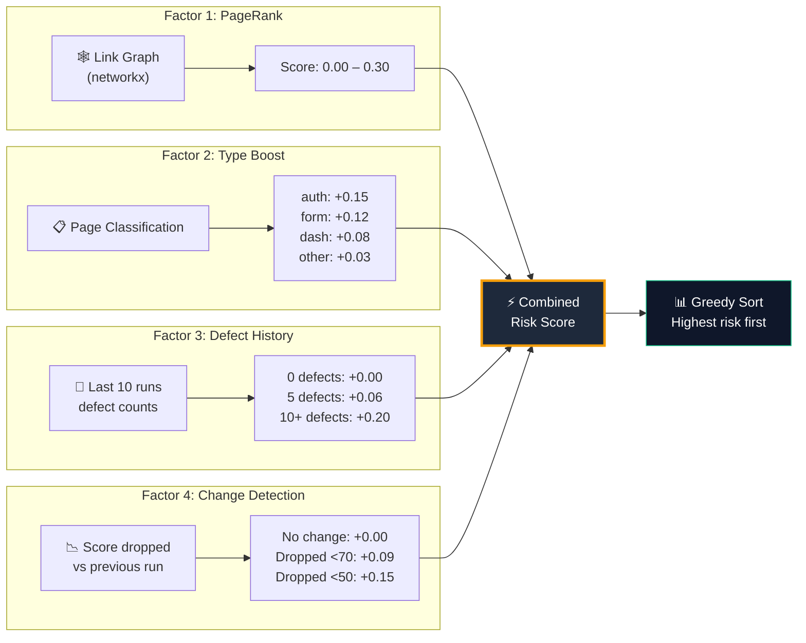

**Example risk scoring output:**

```
  ┌──────────────────────────────────────────────────────────────────────┐
  │  RISK PRIORITY ORDER (top 5 pages)                                  │
  │──────────────────────────────────────────────────────────────────────│
  │                                                                      │
  │  #  PAGE           SCORE   BREAKDOWN                                │
  │  ── ──────────────  ─────   ────────────────────────────────────     │
  │  1. /login          0.412   PR:0.062 + type:0.15 + hist:0.200 + chg:0.000  │
  │  2. /checkout       0.355   PR:0.085 + type:0.12 + hist:0.100 + chg:0.050  │
  │  3. /settings       0.285   PR:0.045 + type:0.12 + hist:0.060 + chg:0.060  │
  │  4. /dashboard      0.238   PR:0.100 + type:0.08 + hist:0.028 + chg:0.030  │
  │  5. /about          0.067   PR:0.034 + type:0.03 + hist:0.003 + chg:0.000  │
  │                                                                      │
  │  ✅ /login tested first (highest combined risk)                     │
  │  ✅ /about tested last (lowest risk — static content)               │
  │                                                                      │
  └──────────────────────────────────────────────────────────────────────┘
```

### 7. WebSockets / Socket.io (The "Live Broadcaster")

- **Why we use it:** Full autonomous testing can take 5-20 minutes. Polling is inefficient. WebSockets keep a permanent two-way "phone line" open between the browser and the server.
- **How it works:**
  1. The React frontend subscribes to a specific `testRunId` room.
  2. The Python AI finishes testing a single page and POSTs the result to the Express Gateway.
  3. The Gateway saves the page to PostgreSQL and instantly broadcasts that data packet over the active WebSocket.
  4. The React UI instantly receives the data and animates it onto the screen without a page refresh.

---

## 🗄️ Database Schema

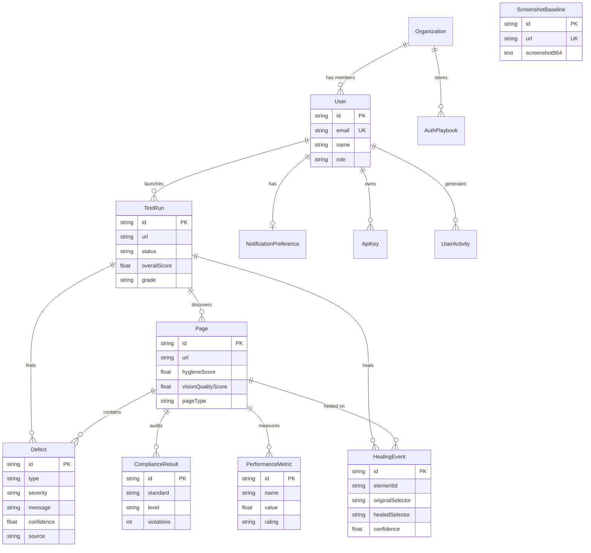

---

## 🚀 Quick Start

### 📋 Prerequisites

- **Node.js** 20+
- **Python** 3.11+
- **Docker & Docker Compose** (Latest)

### 1️⃣ Clone the repository

```bash
git clone https://github.com/rohith2157/BUGZERO.git
cd BUGZERO
```

### 2️⃣ Start infrastructure

```bash
docker-compose up -d
```

### 3️⃣ Setup API Gateway

```bash
cd gateway
npm install
cp .env.example .env          # configure your environment
npx prisma generate
npx prisma db push
node prisma/seed.js            # seed demo data
npm run dev
```

### 4️⃣ Setup AI Core

```bash
cd ai-core
python -m venv venv
# Linux/macOS: source venv/bin/activate
# Windows:     venv\Scripts\activate
pip install -r requirements.txt
playwright install chromium
cp .env.example .env
python main.py
```

### 5️⃣ Setup Frontend

```bash
cd autonomousqa-frontend
npm install
npm run dev
```

### 6️⃣ Open the app

| Service                 | URL                                                     |
| :---------------------- | :------------------------------------------------------ |
| **Frontend**      | [http://localhost:5173](http://localhost:5173)           |
| **API Gateway**   | [http://localhost:3000](http://localhost:3000)           |
| **AI Core Docs**  | [http://localhost:8000/docs](http://localhost:8000/docs) |
| **Neo4j Browser** | [http://localhost:7474](http://localhost:7474)           |
| **Prisma Studio** | Run`cd gateway && npx prisma studio`                  |

> 🔑 **Default Login:**
> Email: `rohith@autonomousqa.io` | Password: `password123`

---

## 📂 Project Structure

```text
BUGZERO/
├── autonomousqa-frontend/         # React + Vite frontend
│   ├── src/
│   │   ├── components/            # Reusable UI components
│   │   │   └── ui/                # Design system primitives
│   │   ├── pages/                 # Route-level page components
│   │   │   ├── Landing.jsx        # Marketing landing page
│   │   │   ├── UseCases.jsx       # 6 AI Agents deep-dive
│   │   │   ├── Dashboard.jsx      # Test history & analytics
│   │   │   ├── NewTest.jsx        # Test configuration launcher
│   │   │   ├── LiveTest.jsx       # Real-time test monitoring + self-healing log
│   │   │   ├── Report.jsx         # Full test report + visual regression section
│   │   │   ├── Compliance.jsx     # WCAG compliance details
│   │   │   └── Performance.jsx    # Core Web Vitals dashboard
│   │   ├── hooks/                 # Custom React hooks (WebSocket, etc.)
│   │   ├── lib/                   # API client & utilities
│   │   ├── store/                 # Zustand state management
│   │   └── data/                  # Mock data (development fallback)
│   ├── index.html
│   └── vite.config.js
│
├── gateway/                       # Express.js API Gateway
│   ├── src/
│   │   ├── routes/
│   │   │   ├── tests.js           # Test CRUD + progress + healing events + history
│   │   │   ├── baselines.js       # 🆕 Visual regression baseline CRUD
│   │   │   ├── auth.js            # JWT authentication
│   │   │   ├── playbooks.js       # Test playbook management
│   │   │   └── settings.js        # User/team/API key settings
│   │   ├── middleware/            # Auth, validation, rate limiting
│   │   └── services/              # Business logic & WebSocket
│   ├── prisma/
│   │   ├── schema.prisma          # Database schema (13 models)
│   │   └── seed.js                # Seed data script
│   └── .env.example
│
├── ai-core/                       # Python FastAPI AI Engine
│   ├── agents/
│   │   ├── crawler.py             # BFS crawler agent
│   │   ├── tester.py              # Page testing agent
│   │   ├── self_healing_agent.py  # 🆕 Fingerprinting + LLM-powered healing
│   │   ├── vision_agent.py        # Gemini Vision + visual regression
│   │   ├── scheduler.py           # PageRank + 4-factor risk scoring
│   │   ├── auth_agent.py          # SSO/OAuth/MFA navigator
│   │   ├── chaos_agent.py         # Network/CPU throttling
│   │   └── report_agent.py        # Site report generator
│   ├── tools/
│   │   ├── playwright_tool.py     # Browser automation + screenshots + DOM access
│   │   └── axe_tool.py            # axe-core WCAG 2.1 scanner
│   ├── models/
│   │   └── schemas.py             # Pydantic models (HealingEvent, VisualRegression, etc.)
│   ├── orchestrator.py            # Multi-stage pipeline coordinator
│   ├── config.py                  # Settings (Gemini API key, etc.)
│   ├── main.py                    # FastAPI entrypoint
│   └── requirements.txt
│
├── documentation/                 # 📚 All project documentation
│   ├── AUTONOMOUSQA_DOCUMENTATION.docx
│   ├── AutonomousQA_Full_Roadmap.docx
│   ├── BROWSERS_AND_CRAWL_DEPTHS.md
│   └── SYSTEM_WORKFLOW.md
│
├── docker-compose.yml             # PostgreSQL + Redis + Neo4j
├── package.json                   # Root workspace scripts
├── CONTRIBUTING.md                # Contribution guidelines
├── CODE_OF_CONDUCT.md             # Community standards
├── SECURITY.md                    # Security policy
└── LICENSE                        # MIT License
```

---

## 📡 API Reference

<details>
<summary><strong>🔐 Authentication</strong></summary>

| Method   | Endpoint               | Description              |
| :------- | :--------------------- | :----------------------- |
| `POST` | `/api/auth/register` | Register a new user      |
| `POST` | `/api/auth/login`    | Login — returns JWT     |
| `GET`  | `/api/auth/me`       | Get current user profile |
| `POST` | `/api/auth/refresh`  | Refresh access token     |

</details>

<details>
<summary><strong>🧪 Test Runs</strong></summary>

| Method     | Endpoint                       | Description                               |
| :--------- | :----------------------------- | :---------------------------------------- |
| `POST`   | `/api/tests`                 | Start a new autonomous test run           |
| `GET`    | `/api/tests`                 | List all test runs                        |
| `GET`    | `/api/tests/:id`             | Get test run details                      |
| `DELETE` | `/api/tests/:id`             | Cancel a running test                     |
| `GET`    | `/api/tests/:id/pages`       | Get page-level results                    |
| `GET`    | `/api/tests/:id/compliance`  | Compliance report                         |
| `GET`    | `/api/tests/:id/performance` | Performance report                        |
| `GET`    | `/api/tests/:id/healing`     | 🆕 Self-healing events for a run          |
| `GET`    | `/api/tests/history/lookup`  | 🆕 Defect history for risk prioritization |

</details>

<details>
<summary><strong>📸 Visual Regression Baselines</strong></summary>

| Method   | Endpoint                       | Description                            |
| :------- | :----------------------------- | :------------------------------------- |
| `GET`  | `/api/baselines?url=&orgId=` | 🆕 Fetch baseline screenshot for a URL |
| `POST` | `/api/baselines`             | 🆕 Save/update baseline screenshot     |

</details>

<details>
<summary><strong>📋 Playbooks</strong></summary>

| Method     | Endpoint               | Description          |
| :--------- | :--------------------- | :------------------- |
| `GET`    | `/api/playbooks`     | List saved playbooks |
| `POST`   | `/api/playbooks`     | Create a playbook    |
| `PUT`    | `/api/playbooks/:id` | Update a playbook    |
| `DELETE` | `/api/playbooks/:id` | Delete a playbook    |

</details>

<details>
<summary><strong>⚙️ Settings</strong></summary>

| Method     | Endpoint                       | Description          |
| :--------- | :----------------------------- | :------------------- |
| `GET`    | `/api/settings/team`         | Get team members     |
| `PUT`    | `/api/settings/profile`      | Update user profile  |
| `GET`    | `/api/settings/api-keys`     | List API keys        |
| `POST`   | `/api/settings/api-keys`     | Generate new API key |
| `DELETE` | `/api/settings/api-keys/:id` | Revoke an API key    |

</details>

### WebSocket Events

| Event               | Direction        | Description                     |
| :------------------ | :--------------- | :------------------------------ |
| `test:started`    | Server → Client | Test run initiated              |
| `page:discovered` | Server → Client | New page found during crawl     |
| `page:complete`   | Server → Client | Page testing finished           |
| `defect:found`    | Server → Client | Defect detected in real time    |
| `heal:success`    | Server → Client | 🆕 Self-healing selector repair |
| `test:complete`   | Server → Client | Full test run finished          |
| `test:cancel`     | Client → Server | Request to cancel a test        |

---

## 🗄️ Database Schema

The platform uses **13 Prisma models** across PostgreSQL:

| Model                      | Purpose                                                                |
| :------------------------- | :--------------------------------------------------------------------- |
| `User`                   | Authentication & profile                                               |
| `Organization`           | Team management                                                        |
| `TestRun`                | Test execution records                                                 |
| `Page`                   | Discovered pages with scores                                           |
| `Defect`                 | Detected bugs with severity                                            |
| `ComplianceResult`       | WCAG/GDPR violations                                                   |
| `PerformanceMetric`      | Core Web Vitals per page                                               |
| `HealingEvent`           | 🆕 Self-healing audit trail (original → healed selector + confidence) |
| `ScreenshotBaseline`     | 🆕 Visual regression baseline screenshots per URL                      |
| `AuthPlaybook`           | Saved authentication strategies                                        |
| `ApiKey`                 | API key management                                                     |
| `NotificationPreference` | Notification settings                                                  |
| `UserActivity`           | Activity tracking                                                      |

---

## 🗺️ Roadmap

- [X] Autonomous web crawler with Playwright
- [X] Accessibility auditing (axe-core WCAG 2.1 AA)
- [X] Real-time dashboard with WebSocket
- [X] JWT authentication & team management
- [X] Playbook save/replay system
- [X] Core Web Vitals performance monitoring
- [X] Gemini Vision AI visual bug detection
- [X] 🆕 Self-healing tests with semantic fingerprinting
- [X] 🆕 Visual regression AI with baseline comparison
- [X] 🆕 Risk prioritization with defect history + change detection
- [X] 🆕 Self-healing audit trail (DB + frontend UI)
- [ ] Natural language test generation (LangChain + OpenAI)
- [ ] CI/CD pipeline integration (GitHub Actions, Jenkins)
- [ ] PDF/HTML report export
- [ ] Multi-browser support (Firefox, WebKit)
- [ ] Scheduled recurring test runs
- [ ] Slack / Teams notification integration

---

## 🤝 Contributing

We love contributions! Whether it's fixing a typo or building a new AI agent, every bit helps.

1. **Fork** the repository
2. **Create** your feature branch (`git checkout -b feat/amazing-feature`)
3. **Commit** your changes (`git commit -m 'feat: add amazing feature'`)
4. **Push** to the branch (`git push origin feat/amazing-feature`)
5. **Open** a Pull Request

Please read our [Contributing Guide](./CONTRIBUTING.md) and [Code of Conduct](./CODE_OF_CONDUCT.md) before getting started.

---

## 🛡️ Security

Found a vulnerability? Please report it responsibly. See our [Security Policy](./SECURITY.md) for details.

---

## 📄 License

This project is licensed under the **MIT License** — see the [LICENSE](./LICENSE) file for details.

---

## 🙏 Acknowledgments

- **[Playwright](https://playwright.dev/)** — Browser automation
- **[axe-core](https://github.com/dequelabs/axe-core)** — Accessibility testing engine
- **[Google Gemini](https://ai.google.dev/)** — Vision AI & LLM reasoning
- **[Prisma](https://www.prisma.io/)** — Next-generation ORM
- **[Framer Motion](https://www.framer.com/motion/)** — Animation library
- **[networkx](https://networkx.org/)** — PageRank graph analysis

---

<div align="center">
  <p><strong>Built with ❤️ by <a href="https://github.com/rohith2157">Rohith</a></strong></p>
  <p><sub>If AutonomousQA helped you, consider giving it a ⭐</sub></p>
</div>
