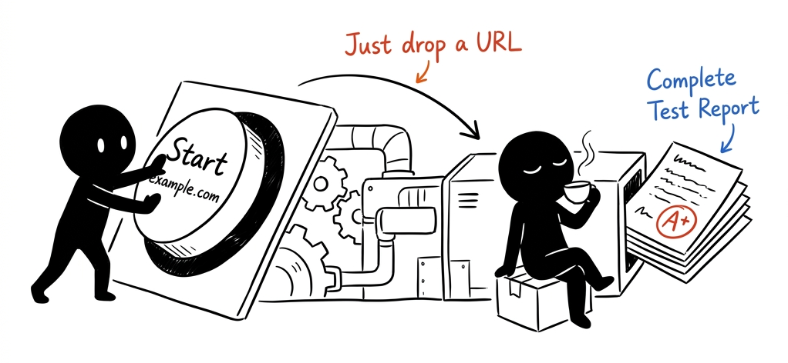
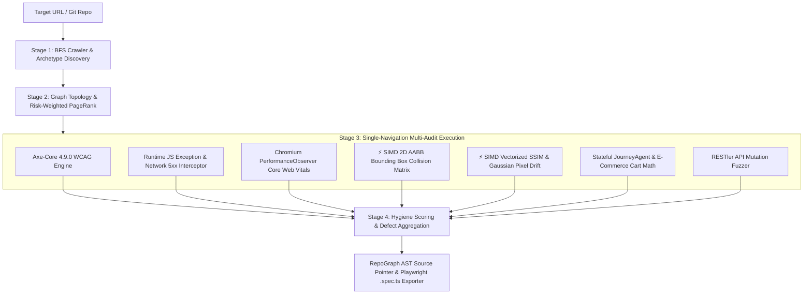

<div align="center">

# 🚀 BUGZERO
### AutonomousQA: Next-Generation Autonomous Web Quality Engineering Platform
**Zero-Touch • Zero-Script • 100% Deterministic • \$0 API Token Cost**

[](https://www.python.org/downloads/)
[](https://nodejs.org/)
[](https://playwright.dev/)
[](https://github.com/dequelabs/axe-core)
[](documentation/SIMD_ACCELERATION_SPEC.md)
[](https://huggingface.co/spaces/rohith2157/vlm_for_bugzero)
[](LICENSE)

<br>



<br>
<em>AutonomousQA deploys specialized autonomous agents that explore web applications, execute stateful user journeys, fuzz API contracts, localize code bugs to exact file lines, and synthesize executable Playwright tests.</em>

</div>

---

## 💡 What is AutonomousQA?

Writing and maintaining end-to-end test scripts is slow, brittle, and expensive. As UIs evolve, traditional test automation suites break constantly, while manual QA fails to scale across rapid CI/CD deployment cycles.

**AutonomousQA (BUGZERO)** transforms quality assurance into an **active, autonomous engineering system**. Point it at a production URL or a GitHub repository — it automatically:
- **Crawls & Maps:** Discovers pages using Breadth-First Search (BFS) and classifies application archetypes (E-Commerce, Auth, Search, Forms).
- **Prioritizes:** Constructs a directional topology graph and computes eigenvector PageRank to prioritize high-risk user routes.
- **Single-Navigation Multi-Audit:** Runs accessibility audits (Axe-Core 4.9.0), Core Web Vitals, runtime JS crash trapping, and SIMD visual collision checks in a single page lifecycle.
- **Explores & Asserts:** Synthesizes stateful user journeys (e.g. Search $\to$ Add to Cart $\to$ Subtotal Math) and verifies arithmetic truth without hardcoded scripts.
- **Synthesizes Tests & Localizes Faults:** Auto-generates standalone Playwright `.spec.ts` reproduction scripts and maps runtime defects directly to repository source lines (`file:line`).

---

## ⚡ AutonomousQA vs. Google Lighthouse vs. Scripted QA

| Dimension | Manual / Scripted QA (Playwright / Cypress) | Google Lighthouse / Axe CLI | **AutonomousQA (BUGZERO)** |
| :--- | :--- | :--- | :--- |
| **Setup Cost** | Weeks writing fragile CSS/XPath selectors | Instant single-page audit | **Instant Zero-Config (Single URL or Repo)** |
| **Interaction Model** | Fixed, hardcoded test paths | Passive static DOM observer (No clicks) | **Active Agentic Explorer (Clicks, Tabs, Forms)** |
| **Stateful Journeys** | Manually scripted per user story | None (Cannot traverse e-commerce flows) | **Autonomous Multi-Step Synthesis & Cart Math** |
| **Visual Regressions** | Brittle pixel diffing (anti-aliasing noise) | None | **SIMD AVX2 SSIM + NVIDIA Eagle2-2B ZeroGPU** |
| **Crash Trapping** | Manual error assertions required | Ignored during test runs | **Traps Unhandled JS Errors & 5xx API Failures** |
| **Fault Localization** | Developer must manually debug logs | None | **RepoGraph AST Symbol Graph (`file:line`)** |
| **Output Deliverable** | Pass/Fail assertion log | Static PDF / JSON report | **Executable Playwright `.spec.ts` + Git PR Fixes** |
| **Operational Cost** | High engineering maintenance debt | Free but limited | **\$0.00 Local Computation (Offline Deterministic)** |

---

## 🔬 Next-Gen Research Capabilities

AutonomousQA integrates breakthrough software engineering and programming languages research:

```
┌────────────────────────────────────────────────────────────────────────────────────────────────────────┐
│                                   AUTONOMOUS QA 5-STAGE PIPELINE                                       │
└────────────────────────────────────────────────────────────────────────────────────────────────────────┘
                                                    │
                 ┌──────────────────────────────────┴──────────────────────────────────┐
                 ▼                                                                     ▼
     [Pre-Stage 0: KISS Sorcar]                                             [Stage 1: Dynamic Crawl]
Ephemeral Git Worktree Isolation & Port Allocation                       Crawl with Graph Pagerank Scoring
                 │                                                                     │
                 ▼                                                                     ▼
     [Stage 2: Goal-Driven Exploration (UI-TARS)]                          [Stage 3: Multi-Vector Scan]
DOM Affordance Clustering & Semantic Goal Synthesis                      Single-Pass Context Re-use
                 │                                                                     │
                 ├─────────────────────────────────┬───────────────────────────────────┤
                 ▼                                 ▼                                   ▼
        [Axe-Core 4.9.0]                [SIMD AVX2 Vision]                   [API Mutation Fuzzer]
     WCAG 2.2 AA Compliance           Zero-Collision Overlaps               RESTler Contract Fuzzing
                 │                                 │                                   │
                 └─────────────────────────────────┼───────────────────────────────────┘
                                                   ▼
                                  [Fault Localization: RepoGraph]
                                AST Source Symbol Graph (File:Line)
                                                   │
                                                   ▼
                                [Test Synthesizer: USEagent 2026]
                           Executable Playwright .spec.ts Generation
```

### 1. 🧪 Automated Playwright `.spec.ts` Synthesizer (*USEagent — ICSE 2026*)
- When a defect is discovered, AutonomousQA automatically writes an executable TypeScript test file using `@playwright/test`.
- Test scripts are self-contained with exact selectors, viewport settings, actions, and assertions saved directly into `benchmarks/generated_tests/`.

### 2. 🧭 RepoGraph AST Fault Localization (*RepoGraph — ICLR 2025*)
- Parses your application's source repository using Python's native `ast` parser and regex grammar analyzers.
- Indexes functions, classes, and React components, mapping runtime browser exceptions and accessibility violations directly to `file_path:line_number (symbol)`.

### 3. 🛡️ Ephemeral Git Worktrees & Dynamic Port Sandboxing (*KISS Sorcar — UC Berkeley 2026*)
- Tests repositories without touching uncommitted changes or risking branch collisions during concurrent CI checks.
- Uses `git worktree add --detach` combined with kernel-level socket port probing (`0.0.0.0:0`) for collision-free parallel execution.

### 4. ⚡ Autonomous API Contract Mutation Fuzzer (*RESTler — IEEE S&P*)
- Intercepts live browser network requests (POST, PUT, PATCH), infers runtime JSON request schemas, and dispatches 7 high-yield mutation vectors (boundary integers, buffer overflows, type confusion, null injection).
- Detects and flags unhandled HTTP 5xx server crashes with reproducible payloads.

### 5. 🎯 Goal-Driven Semantic Affordance Explorer (*UI-TARS — ByteDance 2025 / WebGUM — Google*)
- Dynamically clusters DOM affordances (search catalogs, filters, navigation tabs, actionable buttons) without costly LLM tokens.
- Synthesizes goal-oriented user journeys and verifies state mutation responsiveness.

---

## 🏗️ System Architecture & 4-Stage Multi-Audit Engine


```mermaid
flowchart TD
    A[Target URL / Git Repo] --> B[Stage 1: BFS Crawler & Archetype Discovery]
    B --> C[Stage 2: Graph Topology & Risk-Weighted PageRank]
    C --> D[Stage 3: Single-Navigation Multi-Audit Engine]
  
    subgraph D [Stage 3: Single-Navigation Multi-Audit Execution]
        D1[Axe-Core 4.9.0 WCAG Engine]
        D2[Runtime JS Exception & Network 5xx Interceptor]
        D3[Chromium PerformanceObserver Core Web Vitals]
        D4[⚡ SIMD 2D AABB Bounding Box Collision Matrix]
        D5[⚡ SIMD Vectorized SSIM & Gaussian Pixel Drift]
        D6[Stateful JourneyAgent & E-Commerce Cart Math]
        D7[RESTler API Mutation Fuzzer]
    end
  
    D1 --> E[Stage 4: Hygiene Scoring & Defect Aggregation]
    D2 --> E
    D3 --> E
    D4 --> E
    D5 --> E
    D6 --> E
    D7 --> E
    E --> F[RepoGraph AST Source Pointer & Playwright .spec.ts Exporter]
```

### Single-Pass Navigation Efficiency
Traditional scanners reload a webpage 5 to 6 times to run separate accessibility, performance, visual, and SEO checks. AutonomousQA executes **all 7 audit vectors during a single browser page lifecycle**, eliminating 80%+ of redundant network and rendering overhead.

### Dual-Tier Visual Regression
1. **Tier 1 (NVIDIA Eagle2-2B ZeroGPU)**: Cloud-hosted Vision-Language Model semantically verifies complex visual layouts and filters intentional styling from real defects.
2. **Tier 2 (AVX2 SIMD & Local PIL)**: 100% offline fallback computing Gaussian-blurred Structural Similarity (SSIM) and pairwise Axis-Aligned Bounding Box (AABB) collisions in `<2ms`.

---

## 📂 Project Directory Structure

```text
BUGZERO/
├── autonomousqa-frontend/         # React 18 + Vite Frontend Dashboard
│   ├── src/
│   │   ├── pages/                 # Dashboard, LiveTest, Report, NewTest, Compliance
│   │   ├── components/            # UI components & interactive X-Ray blueprint
│   │   └── hooks/                 # WebSocket streaming telemetry hooks
│   └── vite.config.js             # Vite development server
│
├── gateway/                       # Express.js API Gateway & WebSocket Server
│   ├── src/
│   │   ├── routes/                # Tests, Auth, Playbooks, Baselines, Settings
│   │   └── services/              # Test orchestration & real-time WebSocket broker
│   └── prisma/
│       └── schema.prisma          # Database schema (SQLite / PostgreSQL)
│
├── ai-core/                       # Python 3.11+ Autonomous AI Engine
│   ├── agents/
│   │   ├── test_synthesizer.py    # 🧪 Playwright .spec.ts synthesizer (USEagent)
│   │   ├── goal_explorer.py       # 🎯 Goal-driven affordance explorer (UI-TARS)
│   │   ├── api_fuzzer.py          # ⚡ RESTler mutation contract fuzzer
│   │   ├── journey_agent.py       # 🧭 Stateful user journeys & cart math
│   │   ├── vision_agent.py        # 👁️ Dual-tier visual regression engine
│   │   ├── crawler.py             # 🕷️ BFS crawler & page archetype classifier
│   │   ├── scheduler.py           # 📊 PageRank & 4-factor risk scheduler
│   │   ├── auth_agent.py          # 🔐 Automated login & form navigator
│   │   ├── chaos_agent.py         # 🌪️ Network & CPU latency injection
│   │   └── pr_bot.py              # 🤖 Automated GitHub PR auto-fix generator
│   ├── tools/
│   │   ├── playwright_tool.py     # Single-navigation Playwright harness
│   │   └── axe_tool.py            # axe-core 4.9.0 WCAG scanner
│   ├── utils/
│   │   ├── repograph.py           # 🧭 RepoGraph AST fault localizer (ICLR 2025)
│   │   ├── repo_server.py         # 🛡️ Ephemeral worktree sandboxing (KISS Sorcar)
│   │   ├── simd_vision_engine.py  # ⚡ AVX2 vectorized SSIM math
│   │   └── simd_collision_engine.py # 📐 SIMD 2D AABB bounding box collision
│   ├── orchestrator.py            # Master 4-stage pipeline orchestrator
│   └── main.py                    # FastAPI service entrypoint (Port 8000)
│
├── documentation/                 # 📚 Authoritative Technical Documentation
│   ├── 01_PIPELINE_AND_JOURNEY_ENGINE.md
│   ├── 02_REAL_WORLD_BENCHMARKS_AND_AUDIT.md
│   ├── 03_TITAN_LIGHTHOUSE_BENCHMARK_MASTER.md
│   ├── SIMD_ACCELERATION_SPEC.md
│   ├── SYSTEM_WORKFLOW.md
│   └── github_engine_design.md
│
├── benchmarks/                    # 🧪 Benchmarks & Generated Tests
│   ├── generated_tests/           # Synthesized Playwright .spec.ts test suites
│   ├── research/                  # Research implementation compendium & papers
│   └── reports/                   # Performance & Lighthouse audit logs
│
└── docker-compose.yml             # Optional containerized database infrastructure
```

---

## 🚀 Quick Start Guide

### Prerequisites
- **Node.js** 20+ and **npm**
- **Python** 3.11+
- **Git**

### 1️⃣ Clone the Repository
```bash
git clone https://github.com/rohith2157/BUGZERO.git
cd BUGZERO
```

### 2️⃣ Start API Gateway (Port 3000)
```bash
cd gateway
npm install
npx prisma db push
node prisma/seed.js
npm run dev
```

### 3️⃣ Start AI Core (Port 8000)
```bash
cd ../ai-core
python -m venv venv

# Windows:
venv\Scripts\activate
# Linux / macOS:
# source venv/bin/activate

pip install -r requirements.txt
playwright install chromium
python main.py
```

### 4️⃣ Start Frontend Studio (Port 5173)
```bash
cd ../autonomousqa-frontend
npm install
npm run dev
```

### 5️⃣ Access the Application
Open **[http://localhost:5173](http://localhost:5173)** in your browser.
- **Default Login**: `rohith@autonomousqa.io` | **Password**: `password123`

---

## 📡 Live Telemetry & API Reference

### Core Endpoints
- `POST /api/tests`: Launch autonomous test run (`{ url: "https://example.com", config: { depth: "standard" } }`).
- `GET /api/tests/:id`: Fetch real-time run status, page hygiene scores, and defect breakdowns.
- `GET /api/tests/:id/pages`: View granular page metrics (Core Web Vitals, Axe violations, visual drift).
- `GET /api/auth/github`: Initiate GitHub OAuth integration for repository-mode testing.

### Real-Time WebSocket Events (`ws://localhost:3000`)
- `test:started`: Pipeline initialized with target parameters.
- `page:discovered`: New internal URL queued by the BFS spider.
- `page:complete`: Single-navigation audit finished for a page.
- `defect:found`: Defect emitted with selector, WCAG rule, and synthesized Playwright `.spec.ts`.
- `test:complete`: Full test suite completed with overall compliance score and summary grade.

---

## 📚 Technical Documentation Hub

For detailed engineering specs, mathematical formulas, and empirical research papers, explore [`documentation/`](documentation/):

- 🧭 **[Pipeline & Journey Engine](documentation/01_PIPELINE_AND_JOURNEY_ENGINE.md)**: Single-navigation context reuse and cart arithmetic.
- 🧪 **[5-Website Live Audit Matrix](documentation/02_REAL_WORLD_BENCHMARKS_AND_AUDIT.md)**: Empirical test results on GitHub, Hacker News, Swiggy, and BFL AI.
- 🏛️ **[Lighthouse vs. AutonomousQA Benchmark](documentation/03_TITAN_LIGHTHOUSE_BENCHMARK_MASTER.md)**: Head-to-head comparison and 70k-line telemetry breakdown.
- ⚡ **[SIMD AVX2 Hardware Acceleration Spec](documentation/SIMD_ACCELERATION_SPEC.md)**: 256-bit vector registers for SSIM and AABB collision geometry.
- 🔄 **[End-to-End System Workflow](documentation/SYSTEM_WORKFLOW.md)**: Full lifecycle manual and architectural specifications.
- 🔬 **[Next-Gen Research Compendium](benchmarks/research/NEXT_GEN_RESEARCH_IMPLEMENTATION.md)**: Implementation details for USEagent, RepoGraph, KISS Sorcar, RESTler, and UI-TARS.

---

## 🛡️ License & Contributing

- **License**: MIT License — see [LICENSE](LICENSE) for details.
- **Contributions**: Pull requests are welcome! Please consult [CONTRIBUTING.md](CONTRIBUTING.md) and [CODE_OF_CONDUCT.md](CODE_OF_CONDUCT.md).

<div align="center">
  <p><strong>Developed with precision by the BUGZERO Engineering Team</strong></p>
</div>
