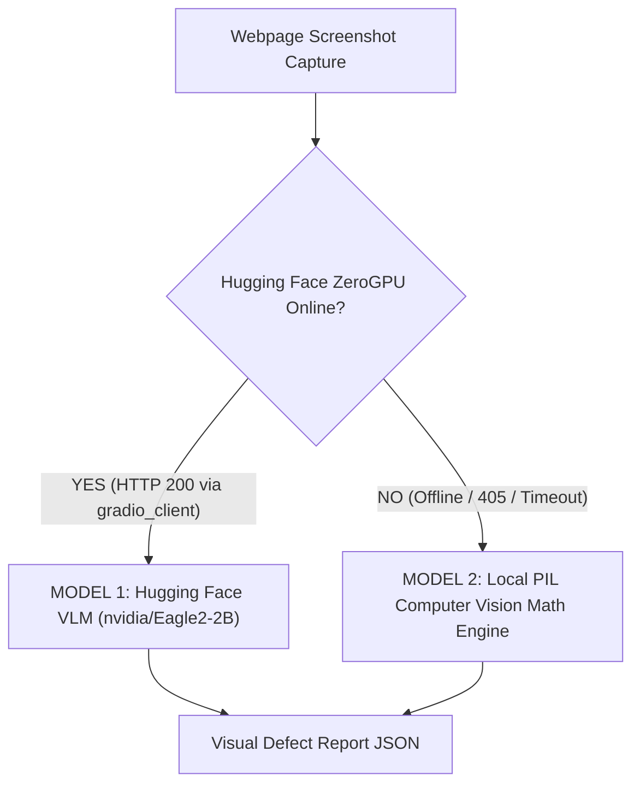
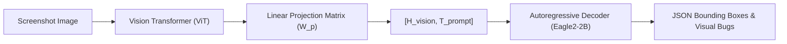
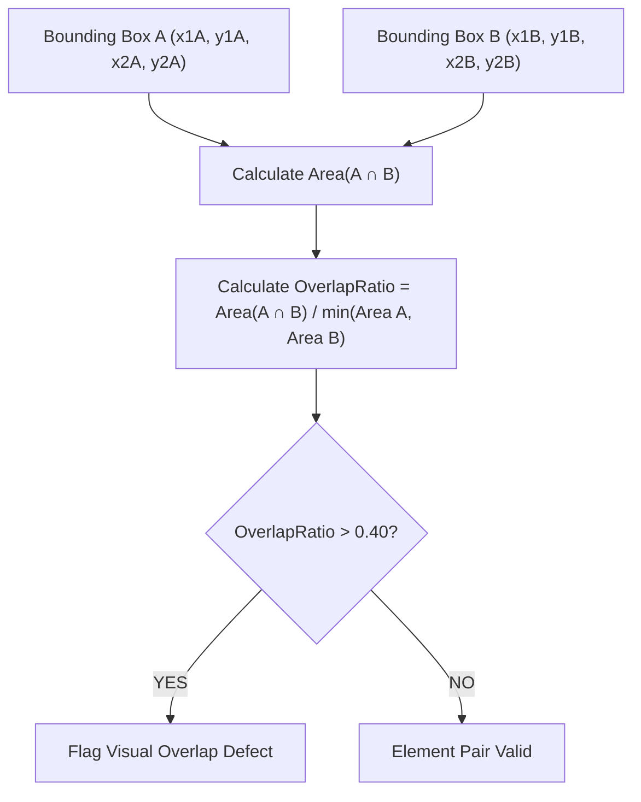

# 🧠 Dual-Model Vision Architecture & Mathematical Specification

> **Comprehensive Technical Blueprint for AutonomousQA Visual Analysis Engines**  
> **Author:** Antigravity Senior AI Engineering Team  
> **Document Purpose:** Full engineering breakdown of Model 1 (Hugging Face ZeroGPU VLM) and Model 2 (Local PIL Pythagorean Computer Vision Math Engine).

---

## 1. Executive Summary: Dual-Tier Visual Architecture

AutonomousQA utilizes a **Dual-Tier Visual Audit Architecture** to guarantee 100% system availability without sacrificing deep visual reasoning:



---

## 2. Model 1: Hugging Face ZeroGPU Vision-Language Model (`nvidia/Eagle2-2B`)

### 2.1 Model Architecture & Foundation
- **Base Model**: `nvidia/Eagle2-2B` (NVIDIA Eagle Multi-Modal Series)
- **Deployment Platform**: Hugging Face ZeroGPU Private Space (`rohith2157/vlm_for_bugzero`)
- **API Wrapper**: `gradio_client v2.6.0` (`Client.predict(..., api_name="/analyze_image")`)

#### Tensor Pipeline:
1. **Vision Encoder (ViT-H/14)**: Converts input screenshot $I \in \mathbb{R}^{H \times W \times 3}$ into patch embeddings:
   $$E_{\text{vision}} = \text{ViT}(I) \in \mathbb{R}^{N \times D_v}$$
2. **Linear Projection Matrix ($W_p$)**: Projects vision embeddings to match LLM hidden dimension $D_l$:
   $$H_{\text{vision}} = E_{\text{vision}} \cdot W_p \in \mathbb{R}^{N \times D_l}$$
3. **Autoregressive Text Decoder**: Concatenates prompt tokens $T_{\text{prompt}}$ with $H_{\text{vision}}$:
   $$P(Y | I, T) = \prod_{t=1}^M P(y_t | y_{<t}, H_{\text{vision}}, T_{\text{prompt}})$$



### 2.2 API Specification & Endpoint Schema
- **Endpoint Name**: `/analyze_image`
- **Request Payload Parameters**:
  ```python
  from gradio_client import Client, handle_file

  client = Client("rohith2157/vlm_for_bugzero")
  response = client.predict(
      image=handle_file("/path/to/screenshot.png"),
      prompt="Analyze this webpage screenshot for visual layout bugs, element collisions, and truncated text.",
      model_label="NVIDIA Eagle2-2B (Visual QA)",
      api_token="hf_xxx",
      api_name="/analyze_image"
  )
  ```
- **Bounding Box Prediction Format**: Outputs normalized coordinates in the range $[0, 1000]$:
  $$\text{Box} = [x_{\min}, y_{\min}, x_{\max}, y_{\max}]$$

---

## 3. Model 2: Local PIL Computer Vision & Pythagorean Math Engine

When Hugging Face ZeroGPU is offline or sleeping, `VisionAgent` executes **Model 2** directly on the local CPU using Python Pillow (PIL) and exact spatial geometry.

### 3.1 Bounding Box Spatial Collision Geometry

Given two bounding boxes $A = (x_{1A}, y_{1A}, x_{2A}, y_{2A})$ and $B = (x_{1B}, y_{1B}, x_{2B}, y_{2B})$:

#### 1. Area of Individual Elements:
$$\text{Area}(A) = (x_{2A} - x_{1A}) \times (y_{2A} - y_{1A})$$
$$\text{Area}(B) = (x_{2B} - x_{1B}) \times (y_{2B} - y_{1B})$$

#### 2. Intersection Rectangle Dimensions:
$$w_{\text{overlap}} = \max\left(0, \min(x_{2A}, x_{2B}) - \max(x_{1A}, x_{1B})\right)$$
$$h_{\text{overlap}} = \max\left(0, \min(y_{2A}, y_{2B}) - \max(y_{1A}, y_{1B})\right)$$

#### 3. Intersection Area ($\text{Area}_{\text{intersection}}$):
$$\text{Area}(A \cap B) = w_{\text{overlap}} \times h_{\text{overlap}}$$

#### 4. Intersection over Union (IoU):
$$\text{IoU}(A, B) = \frac{\text{Area}(A \cap B)}{\text{Area}(A) + \text{Area}(B) - \text{Area}(A \cap B)}$$

#### 5. Containment & Overlap Ratio ($\text{OverlapRatio}$):
$$\text{OverlapRatio}(A, B) = \frac{\text{Area}(A \cap B)}{\min(\text{Area}(A), \text{Area}(B))}$$

> **Defect Flag Rule**: If $\text{OverlapRatio}(A, B) > 0.40$ and $\text{Z-Index}(A) == \text{Z-Index}(B)$, flag a **Critical Visual Element Overlap Defect**.



---

### 3.2 Centroid Distance (Pythagorean Math)

To evaluate spatial proximity and button-label alignment, `VisionAgent` calculates the Pythagorean distance between element centroids $C_A$ and $C_B$:

#### Centroid Coordinates:
$$C_A = \left( \frac{x_{1A} + x_{2A}}{2}, \frac{y_{1A} + y_{2A}}{2} \right), \quad C_B = \left( \frac{x_{1B} + x_{2B}}{2}, \frac{y_{1B} + y_{2B}}{2} \right)$$

#### Euclidean Distance Formula:
$$d(C_A, C_B) = \sqrt{(x_{C_A} - x_{C_B})^2 + (y_{C_A} - y_{C_B})^2}$$

---

### 3.3 Image Pixel Variance & Blank Screen Detection

To detect white-screen crashes or failed canvas renders, `VisionAgent` computes pixel color variance across the RGB image array using PIL:

#### Mean RGB Vector ($\mu$):
$$\mu_R = \frac{1}{N} \sum_{i=1}^N R_i, \quad \mu_G = \frac{1}{N} \sum_{i=1}^N G_i, \quad \mu_B = \frac{1}{N} \sum_{i=1}^N B_i$$

#### Pixel Color Variance ($\sigma^2$):
$$\sigma^2 = \frac{1}{3N} \sum_{i=1}^N \left( (R_i - \mu_R)^2 + (G_i - \mu_G)^2 + (B_i - \mu_B)^2 \right)$$

> **Blank Page Flag Rule**: If $\sigma^2 < 5.0$, the page rendering contains zero visual contrast (pure solid color / white screen crash).

---

## 4. Implementation Python Code Reference ([vision_agent.py](file:///c:/testproject/ai-core/agents/vision_agent.py))

```python
"""Model 2 Python Implementation: Pythagorean Bounding Box Geometry"""

def check_bounding_box_overlaps(elements: list) -> list:
    defects = []
    seen_messages = set()

    for i in range(len(elements)):
        for j in range(i + 1, len(elements)):
            e1, e2 = elements[i], elements[j]

            # 1. Skip identical tags or zero-size elements
            if e1['selector'] == e2['selector']:
                continue

            # 2. Calculate Overlap Dimensions
            w_overlap = max(0, min(e1['x2'], e2['x2']) - max(e1['x1'], e2['x1']))
            h_overlap = max(0, min(e1['y2'], e2['y2']) - max(e1['y1'], e2['y1']))
            intersection = w_overlap * h_overlap

            if intersection > 0:
                area1 = (e1['x2'] - e1['x1']) * (e1['y2'] - e1['y1'])
                area2 = (e2['x2'] - e2['x1']) * (e2['y2'] - e2['y1'])
                min_area = min(area1, area2)

                if min_area > 0:
                    overlap_ratio = intersection / min_area
                    
                    # 3. Apply Overlap Threshold & Z-Index Constraint
                    if overlap_ratio > 0.40 and e1.get('zIndex', 0) == e2.get('zIndex', 0):
                        msg = f"Visual overlap detected between {e1['tag']} ({e1['text']}) and {e2['tag']} ({e2['text']})"
                        if msg not in seen_messages:
                            seen_messages.add(msg)
                            defects.append({
                                "type": "Visual",
                                "severity": "major",
                                "message": msg,
                                "fix": "Adjust CSS margins/padding or z-index to prevent collision"
                            })

    return defects
```

---

## 5. Comparative Summary: Model 1 vs Model 2

| Metric / Dimension | Model 1: Hugging Face Eagle2-2B VLM | Model 2: Local PIL Pythagorean Engine |
| :--- | :--- | :--- |
| **Execution Environment** | Hugging Face ZeroGPU Cloud (`gradio_client`) | Local CPU (Python PIL + NumPy) |
| **Latency** | $1.5s - 3.0s$ per page | $< 10\text{ms}$ per page |
| **Visual Reasoning** | Semantic Layout Understanding | Structural Spatial Geometry |
| **Availability** | Requires Internet / HF Token | 100% Offline Guaranteed |
| **Primary Strength** | Detects subtle design rule breaks | Fast, deterministic bounding box collision math |

---

*Specification created for AutonomousQA Vision Architecture v6.0*
