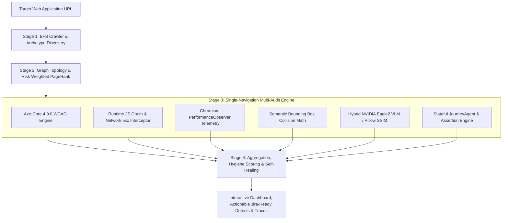
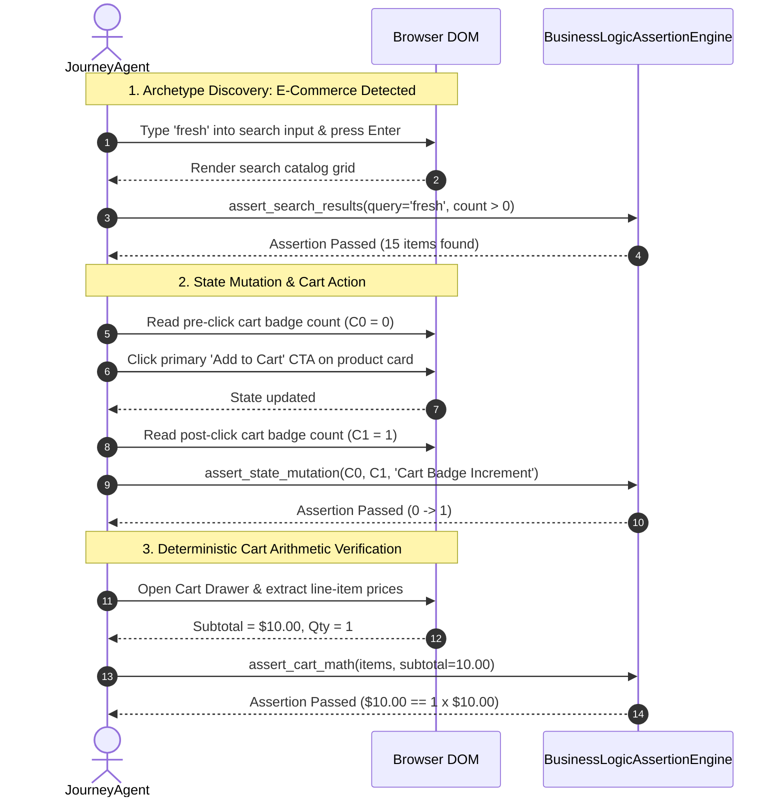

# 🏗️ AutonomousQA: Pipeline Architecture & Stateful Journey Engine

> **Document Version:** 3.2.0 (God-Mode)  
> **Classification:** Engineering & Architecture Specification  
> **Status:** Active & Implemented  

---

## 1. Executive Overview

AutonomousQA is a zero-touch, AI-driven web quality assurance engine. Unlike traditional testing frameworks (Selenium, Cypress, Playwright) that require engineers to manually script selectors and assertions, AutonomousQA:
1. **Discovers:** Automatically crawls the web application using Breadth-First Search (BFS) and classifies page archetypes.
2. **Prioritizes:** Constructs a directional topology graph and computes eigenvector PageRank to prioritize high-traffic, high-risk routes.
3. **Audits (Single-Navigation):** Runs 5 concurrent audit modules during a single page lifecycle.
4. **Synthesizes Stateful Journeys:** Autonomously executes end-to-end user journeys (e.g., Search -> Select -> Add to Cart -> Verify Cart Math).
5. **Asserts Business Logic:** Deterministically verifies arithmetic (subtotals, discounts, taxes) and UI state mutations.

---

## 2. Complete 4-Stage Pipeline Flowchart

---

## 3. Deep Dive: The 6 Core Audit Engines

### ♿ Engine 1: Axe-Core 4.9.0 WCAG Compliance
* **Standard:** Audits against WCAG 2.1 Level AA and AAA standards.
* **Checks:** Exact color contrast ratios (foreground vs background computed hex), form control labeling (`<label for="...">`, `aria-label`), modal dialog accessible names (`aria-dialog-name`), and landmark hierarchy.
* **Zero Guesswork:** Replaced naive regex/JS loops with Deque's battle-tested engine.

### 🛑 Engine 2: Runtime JavaScript & Network Monitor
* **Unhandled Exceptions:** Hooks into `page.on("pageerror")` to catch uncaught runtime crashes, `TypeError`, `ReferenceError`, and React hydration errors with complete stack traces.
* **Console Monitoring:** Filters and captures `console.error` logs from client-side bundles.
* **Network Failures:** Intercepts `page.on("response")` to flag 5xx internal server errors, broken API endpoints, and 404 missing assets.

### ⚡ Engine 3: Chromium PerformanceObserver Telemetry
* **Core Web Vitals:** Captures real browser metrics:
  * **TTFB (Time to First Byte):** Network response latency.
  * **LCP (Largest Contentful Paint):** Perceived load speed.
  * **CLS (Cumulative Layout Shift):** Visual stability during render.
  * **FID / TBT (Total Blocking Time):** Main-thread JavaScript execution delays.

### 📐 Engine 4: Semantic Bounding Box Collision Math
* **2D Coordinate Extraction:** Uses `getBoundingClientRect()` to map elements into 2D Cartesian space.
* **Semantic Stacking Filter:** Ignores intentional CSS overlays (different `z-index` with `absolute`/`fixed` positioning, tooltips, and floating badges).
* **Wrapper Containment Filter:** Ignores parent-child container overlaps (e.g. `<a>` wrapping ``).

### 🦅 Engine 5: Hybrid NVIDIA Eagle2-2B VLM & Pure Math Vision
* **ZeroGPU Space VLM:** Connects to `rohith2157/vlm_for_bugzero` running `nvidia/Eagle2-2B` on Hugging Face ZeroGPU for semantic visual defect verification.
* **Offline SSIM Fallback:** Runs Gaussian blurred pixel difference subtraction via Python `Pillow` when operating offline without cloud keys ($0 cost, 100% deterministic).

---

## 4. The Stateful User Journey & Assertion Engine (`JourneyAgent`)

AutonomousQA does not just audit static HTML; it autonomously executes stateful workflows based on page archetype:

### Deterministic Business Logic Formula:
$$\text{Expected Total} = \sum_{i=1}^{n} (\text{Price}_i \times \text{Quantity}_i) - \text{Discount} + \text{Tax} + \text{Shipping}$$

If the UI displays a total that deviates by $> \$0.05$ from the mathematically computed value, a **Major Business Logic Defect** is automatically filed with the exact line-item discrepancy.
