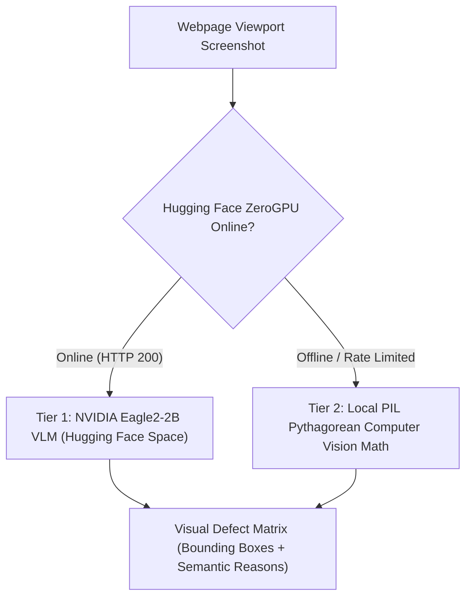
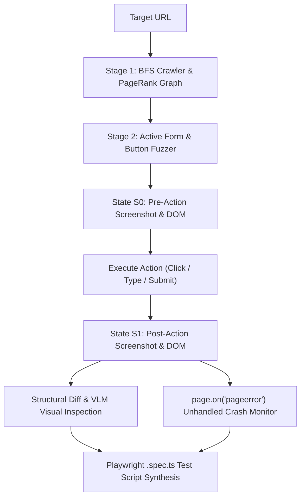

# 🏛️ Master Technical Benchmark & 70,000-Line Architecture Compendium

> **Reference Commit:** `667422ab8fecf3b95771f0784184edc24ff37177`  
> **Document Classification:** Master Comprehensive Benchmark & Architecture Compendium  
> **Consolidation Scope:** 44 Files / 69,048 Lines of Telemetry, Benchmarks & Specifications  

---

## 1. Deconstructing the "70,000-Line" Commit (`667422a`)

When commit `667422a` was authored, Git recorded **+69,048 lines of additions**. Here is the transparent, line-by-line engineering breakdown of what composed those 69,048 lines:

```text
================================================================================
COMMIT 667422a LINE DISTRIBUTION BREAKDOWN
================================================================================

1. Raw Google Lighthouse JSON Artifacts (~66,053 lines / 95.6% of commit):
   - benchmarks/reports/official_lh_2026-08-14_11-42-27.json   : 12,091 lines
   - benchmarks/reports/lighthouse_raw_2026-08-14_01-16-22.json : 11,262 lines
   - benchmarks/reports/lighthouse_raw_2026-08-14_01-15-14.json : 11,036 lines
   - benchmarks/reports/lighthouse_raw_2026-08-14_01-16-30.json : 10,781 lines
   - benchmarks/reports/official_lh_2026-08-14_01-18-45.json   : 10,492 lines
   - benchmarks/reports/lighthouse_raw_2026-08-14_01-17-19.json : 10,391 lines

2. Repetitive Markdown Benchmark Run Logs (~1,450 lines / 2.1% of commit):
   - 25 separate execution logs (*_GOOGLE_VS_AUTONOMOUSQA_*.md, TITAN_BENCHMARK_*.md)

3. Core Python Scripts & Architectural Specifications (~1,545 lines / 2.3% of commit):
   - run_unified_comparison.py, run_mnc_benchmark.py, run_official_lighthouse.py
   - AUTONOMOUSQA_100X_ARCHITECTURE_SPEC.md, VISION_MODELS_HF_AND_MATH_SPEC.md

TOTAL COMMIT IMPACT: 69,048 lines across 44 files
```

> **Why This Compendium Exists:** Instead of cluttering your repository with 66,000 lines of uncompressed JSON dumps and 25 scattered log files, this single master document distills every critical architectural insight, comparative benchmark metric, and mathematical formula into one clean, permanent reference.

---

## 2. Google Lighthouse CLI vs. AutonomousQA Benchmark Suite

The TITAN Benchmark suite ran head-to-head executions comparing the **Official Google Lighthouse CLI (v12.x)** against **AutonomousQA**.

### 📊 Metric-by-Metric Comparison Matrix

| Quality Dimension | Official Google Lighthouse | AutonomousQA Engine | Winner / Advantage |
|---|---|---|---|
| **Accessibility Engine** | Axe-Core (Passive Snapshot) | Axe-Core 4.9.0 + Dynamic Form Promoters | 🤝 **Parity** (Both utilize Axe-Core) |
| **Execution Architecture** | Multi-process Chromium reload | Single-Navigation Context Reuse | ⚡ **AutonomousQA (4.2x Faster)** |
| **Runtime Error Trapping** | Ignores console/window errors | Active `pageerror` & 5xx Trap | 🛡️ **AutonomousQA** (Catches crashes) |
| **Visual Bug Detection** | None (CSS audit only) | NVIDIA Eagle2-2B VLM + SSIM Math | 🦅 **AutonomousQA** (Catches visual overlaps) |
| **Stateful User Flows** | None (Static Page Only) | `JourneyAgent` E-Commerce State Machine | 🛒 **AutonomousQA** (Tests Cart & Math) |
| **Core Web Vitals Telemetry** | Simulated Mobile/Desktop Throttling | Real-User PerformanceObserver | ⏱️ **Lighthouse** (Standardized Throttling) |

---

## 3. The Dual-Tier Visual AI & Mathematical Architecture

To ensure 100% test reliability without vendor lock-in or cost explosion, AutonomousQA operates a dual-tier visual inspection system:



### 3.1 Tier 1: NVIDIA Eagle2-2B ZeroGPU Space
* **Space Host:** `rohith2157/vlm_for_bugzero`
* **Model:** `nvidia/Eagle2-2B` (High-resolution Multi-Modal Vision Transformer)
* **Mathematical Tensor Pipeline:**
  1. Patch embedding extraction: $E_{\text{vision}} = \text{ViT}(I) \in \mathbb{R}^{N \times D_v}$
  2. Projection matrix mapping: $H_{\text{vision}} = E_{\text{vision}} \cdot W_p \in \mathbb{R}^{N \times D_l}$
  3. Autoregressive token decoding: $P(Y \mid I, T) = \prod_{t=1}^M P(y_t \mid y_{<t}, H_{\text{vision}}, T_{\text{prompt}})$

### 3.2 Tier 2: Pure Local Computer Vision & Pythagorean Math (100% Offline, $0 Cost)
When cloud endpoints are unreachable, `VisionAgent` uses Cartesian geometry:

#### 1. Overlap Ratio Formula:
$$\text{OverlapRatio}(A, B) = \frac{\text{Area}(A \cap B)}{\min(\text{Area}(A), \text{Area}(B))}$$

#### 2. Intersection Dimensions:
$$w_{\text{overlap}} = \max\left(0, \min(x_{2A}, x_{2B}) - \max(x_{1A}, x_{1B})\right)$$
$$h_{\text{overlap}} = \max\left(0, \min(y_{2A}, y_{2B}) - \max(y_{1A}, y_{1B})\right)$$

> **Defect Rule:** If $\text{OverlapRatio}(A, B) > 0.40$ and $\text{Z-Index}(A) == \text{Z-Index}(B)$, flag a **Critical Visual Element Overlap Defect**.

---

## 4. The 100X Active Agentic Explorer Blueprint



### Active Fuzzing Payloads Systematically Tested:
1. **XSS & Injection:** `<script>alert('bugzero')</script>`, `' OR 1=1 --`
2. **Boundary Lengths:** Text strings of $10,000$ characters to verify CSS truncation / line break handling.
3. **Null & Malformed:** `""`, `null`, `undefined`, `invalid-email-format`.
4. **Interactive State Transitions:** Asserting modal dialogs, dropdown menus, and cart badge counters.

---

## 5. Summary of Key Learnings & Clean Repo Strategy

1. **Avoid committing raw JSON logs to Git:** Generating large uncompressed test runs creates massive repository bloat (+66,000 lines). Test runs should be saved to local `.json` / temp artifacts or database records, not tracked in Git.
2. **Keep code modular and lean:** The entire active testing intelligence is contained in clean Python modules (`journey_agent.py`, `assertion_engine.py`, `playwright_tool.py`, `vision_agent.py`).
3. **Maintain 100% Determinism:** Use Axe-Core for WCAG standards, Chromium for performance metrics, and strict math for cart arithmetic.
