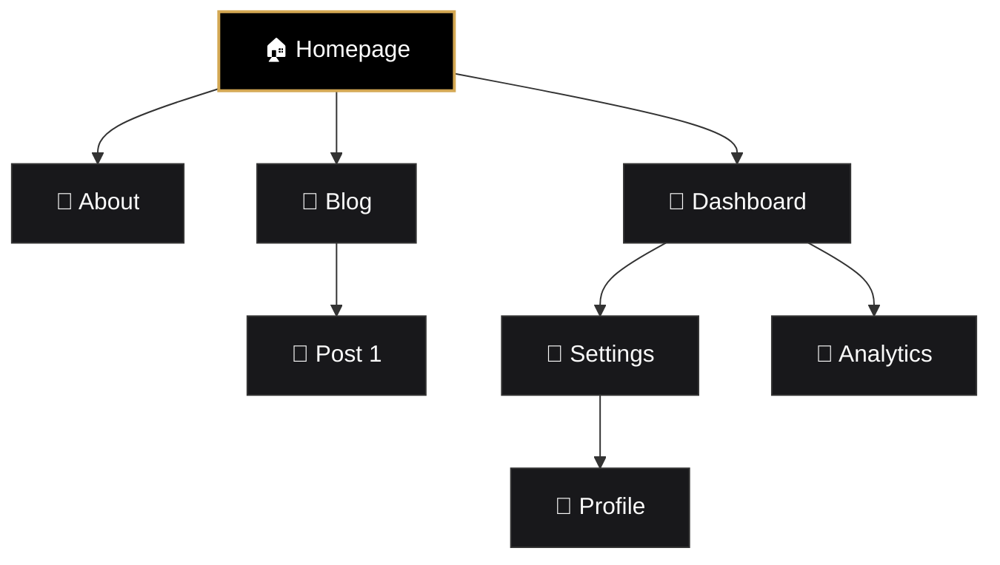
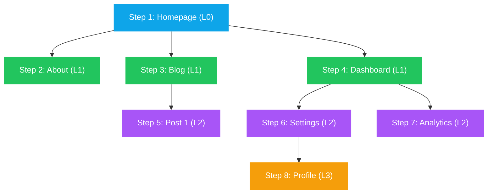
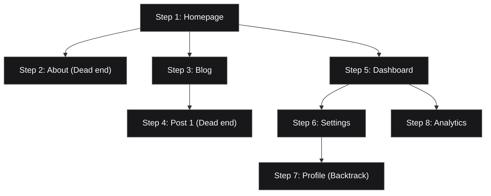

# 🕸️ Crawl Strategy Comparison

> **AutonomousQA** utilizes a Breadth-First Search (BFS) spider to autonomously discover and map your application. This requires zero configuration from the user. 
> 
> Below is a comparison of different crawling strategies and why BFS is the optimal choice for our Autonomous Engine.

---

## 🗺️ Example Site Map

Before comparing strategies, consider a standard web application structure:

---

## ① BFS — Breadth-First Search (✅ WHAT WE USE)

BFS traverses the application **level-by-level** (wide first, then deep).

> [!TIP]
> **Data Structure:** FIFO Queue (First In, First Out)

**How it works:**
1. **Queue:** `[Homepage]` → visit Homepage, enqueue children
2. **Queue:** `[About, Blog, Dashboard]` → visit Level 1 pages sequentially
3. **Queue:** `[Post1, Settings, Analytics]` → visit all Level 2 pages

**Why we use it:**
- ✅ Finds important top-level pages FIRST.
- ✅ Natural depth control (easily respects shallow/standard caps).
- ✅ Guaranteed shortest path to every page.

---

## ② DFS — Depth-First Search

DFS dives deep into a single branch until it hits a dead end, then backtracks.

> [!WARNING]
> **Data Structure:** LIFO Stack (Last In, First Out)

**Pros & Cons:**
- ✅ Low memory usage.
- ✅ Good for finding deep-nested pages.
- ❌ Can easily get lost in deep "rabbit holes" (e.g., infinite calendar links).
- ❌ Misses the breadth of the site if the `max_pages` cap is hit early.

---

## ③ Priority Queue — Best-First Search

Visits the highest-priority (most "interesting" or risky) pages first, based on heuristic scoring.

> [!NOTE]
> **Data Structure:** Priority Queue / Heap

**Scoring Heuristics:**
- Has forms/inputs → **+40 pts**
- Login/Auth page → **+30 pts**
- Dynamic route (/dashboard) → **+20 pts**
- Static content (/blog) → **+5 pts**

**Pros & Cons:**
- ✅ Tests bug-prone pages first.
- ✅ Best use of a highly limited `max_pages` budget.
- ⚠️ Requires complex, often brittle heuristic scoring logic.

---

## ④ Concurrent BFS — Parallel Breadth-First

Same as BFS, but multiple pages are visited simultaneously by a pool of workers.

> [!TIP]
> **Data Structure:** FIFO Queue + Semaphore (N workers)

**Execution Flow:**
- **Step 1:** 🏠 Homepage
- **Step 2:** 📄 About + 📄 Blog + 📄 Dashboard *(Executed in Parallel!)*
- **Step 3:** 📄 Post1 + 📄 Settings + 📄 Analytics *(Executed in Parallel!)*

**Pros & Cons:**
- ✅ 3-5x faster than sequential BFS.
- ✅ Semaphore prevents crashing the target server.
- ⚠️ Higher memory consumption (multiple headless browsers open at once).

---

## 📊 Strategy Comparison Matrix

| Feature | BFS (Current) ✅ | DFS | Priority Queue | Concurrent BFS |
|---------|------------------|-----|----------------|----------------|
| **Data Structure** | FIFO Queue | LIFO Stack | Heap / PQ | Queue + Semaphore |
| **Visit Order** | Level-by-level | Branch-by-branch | Score-based | Level-by-level (Parallel) |
| **Speed** | Moderate | Moderate | Moderate | **Fast** |
| **Coverage** | **Excellent** | Poor breadth | Smart focus | **Excellent** |
| **Memory** | Moderate | **Very Low** | Moderate | Higher |
| **Complexity** | Simple | Simple | Complex | Moderate |
| **Depth Control** | Natural | Hard | Manual | Natural |
| **Best For** | General crawling | Deep hunting | Limited budgets | Large site audits |
