# 🏛️ BugZero Autonomous QA: Master System Architecture Diagram & Topology

> **Document Status:** Production Master Specification
> **System:** BugZero Autonomous QA & SIMD Vector Computing Engine (v3.2.0)
> **Architecture Style:** 4-Tier Hardware-Accelerated Multi-Agent Distributed Engine
> **Date:** August 20, 2026

---

## 1. High-Level Multi-Tier System Topology (Mermaid)

```mermaid
flowchart TD
    %% Styling Definitions
    classDef clientLayer fill:#0f172a,stroke:#38bdf8,stroke-width:2px,color:#f8fafc;
    classDef gatewayLayer fill:#1e1b4b,stroke:#818cf8,stroke-width:2px,color:#f8fafc;
    classDef orchestratorLayer fill:#14532d,stroke:#4ade80,stroke-width:2px,color:#f8fafc;
    classDef agentLayer fill:#312e81,stroke:#a78bfa,stroke-width:2px,color:#f8fafc;
    classDef simdLayer fill:#701a75,stroke:#f472b6,stroke-width:3px,color:#fdf2f8;
    classDef hardwareLayer fill:#78350f,stroke:#fbbf24,stroke-width:2px,color:#fffbeb;

    subgraph Tier1["🖥️ TIER 1: CLIENT PRESENTATION (React 18 + Vite)"]
        UI_DASH["📊 Executive QA Dashboard"]
        UI_BLUEPRINT["📐 2D Cartesian Blueprint Studio<br/>(X-Ray Collision Visualizer)"]
        UI_JOURNEY["🧭 Autonomous Journey Studio<br/>(8/8 Passed State Validation)"]
        UI_WS["⚡ WebSocket Client Hook (`useWebSocket.js`)"]
    end
    class Tier1,UI_DASH,UI_BLUEPRINT,UI_JOURNEY,UI_WS clientLayer;

    subgraph Tier2["🌐 TIER 2: GATEWAY & EVENT STREAMING (Node.js API)"]
        GW_ROUTER["🔀 REST Test Router (`/api/tests`)"]
        GW_WS["📡 Real-Time WebSocket Server (`ws://:5000`)"]
        GW_STORAGE["💾 Baseline Snapshot Store (`/baselines`)"]
    end
    class Tier2,GW_ROUTER,GW_WS,GW_STORAGE gatewayLayer;

    subgraph Tier3["🧠 TIER 3: AI-CORE MULTI-AGENT ORCHESTRATION (Python 3.13)"]
        ORCH["👑 Autonomous Orchestrator (`orchestrator.py`)"]
    
        subgraph Ingestion["🔍 Ingestion & Runtime Monitoring"]
            PW["🎭 Headless Playwright Controller"]
            AXE["♿ Axe-Core 4.9.0 Engine"]
            LISTENERS["🚨 Runtime Error & 4xx/5xx Interceptors"]
        end

        subgraph Swarm["🤖 Autonomous Agent Swarm"]
            AG_VISION["👁️ VisionAgent<br/>(Visual Quality & SSIM)"]
            AG_HEAL["🩹 SelfHealingAgent<br/>(Fuzzy DOM Locators)"]
            AG_JOURNEY["🗺️ JourneyAgent<br/>(Multi-Step Business Flows)"]
            AG_ASSERT["⚖️ AssertionEngine<br/>(Deterministic Pass/Fail)"]
            AG_SCHED["🧭 PageRank Scheduler<br/>(Crawl Priority Graph)"]
        end
    end
    class Tier3,ORCH,Ingestion,PW,AXE,LISTENERS,Swarm,AG_VISION,AG_HEAL,AG_JOURNEY,AG_ASSERT,AG_SCHED orchestratorLayer;

    subgraph Tier4["⚡ TIER 4: SIMD HARDWARE ACCELERATION ENGINE (`ai-core/utils/`)"]
        SIMD_VISION["⚡ `simd_vision_engine.py`<br/>• Vectorized SSIM (Luminance+Variance)<br/>• Single-Pass Decode (`compute_simd_full`)<br/>• MSE Pixel Drift Evaluation"]
        SIMD_COLLISION["📐 `simd_collision_engine.py`<br/>• AABB Boolean Matrix Broadcast ($N \times N$)<br/>• Adaptive Threshold Routing ($N \ge 5000$)<br/>• Stacking ($z\text{-index}$) Context Mask"]
        SIMD_FEATURE["🧬 `simd_feature_engine.py`<br/>• 8D Contiguous Feature Matrix (Tag, ID, Rect)<br/>• Vectorized Dot-Product Cosine Distance<br/>• Zero-Copy BLAS Acceleration"]
    end
    class Tier4,SIMD_VISION,SIMD_COLLISION,SIMD_FEATURE simdLayer;

    subgraph Tier5["⚙️ TIER 5: HARDWARE REGISTERS & INSTRUCTION SET"]
        HW_AVX2["🚀 AVX2 / FMA3 (256-bit Vector Registers)"]
        HW_BLAS["🧵 OpenBLAS 0.3.31 (24 Parallel CPU Threads)"]
        HW_FALLBACK["🛡️ 3-Tier Fallback: AVX2 ➔ NumPy Vectorized ➔ Pillow Scalar"]
    end
    class Tier5,HW_AVX2,HW_BLAS,HW_FALLBACK hardwareLayer;

    %% Data Connections
    UI_WS <==>|Bi-directional WS JSON Stream| GW_WS
    UI_DASH -->|Trigger Test Run| GW_ROUTER
    GW_ROUTER -->|Spawn / Monitor Process| ORCH
    ORCH --> PW
    PW --> AXE
    PW --> LISTENERS
  
    PW -->|Raw Screenshot Bytes & DOM Box Coordinates| AG_VISION
    PW -->|Broken Selectors & Candidate DOM Nodes| AG_HEAL
    PW -->|Interactive Action Trees| AG_JOURNEY
  
    AG_VISION ==>|Contiguous float32 Arrays| SIMD_VISION
    AG_VISION ==>|De-interleaved Coords x1,y1,x2,y2| SIMD_COLLISION
    AG_HEAL ==>|Packed 8D Feature Vectors| SIMD_FEATURE
  
    SIMD_VISION -.-> HW_AVX2
    SIMD_COLLISION -.-> HW_AVX2
    SIMD_FEATURE -.-> HW_BLAS
    SIMD_VISION -.-> HW_FALLBACK
  
    SIMD_VISION -->|SSIM Score & Defect Array| AG_VISION
    SIMD_COLLISION -->|Filtered Collision Defects| AG_VISION
    SIMD_FEATURE -->|Ranked Match Index & Score| AG_HEAL
  
    AG_VISION --> ORCH
    AG_HEAL --> ORCH
    AG_JOURNEY --> ORCH
    AG_ASSERT --> ORCH
    ORCH -->|Aggregated Test Matrix JSON| GW_STORAGE
    GW_WS -->|Live Telemetry Events| UI_WS
```



---

## 2. The 3D Layered Execution Flow (ASCII Representation)

```
┌═════════════════════════════════════════════════════════════════════════════┐
║                      LAYER 1: CLIENT PRESENTATION STUDIO                    ║
║   (React 18 • Blueprint X-Ray Overlap Canvas • Stateful User Journeys)       ║
└──────────────────────────────────────┬──────────────────────────────────────┘
                                       │ WebSocket Telemetry Events
                                       ▼
┌═════════════════════════════════════════════════════════════════════════════┐
║                      LAYER 2: GATEWAY & EVENT BROKER                         ║
║   (Express API • Test Dispatcher • Baseline Snapshot Cache • WS Streamer)   ║
└──────────────────────────────────────┬──────────────────────────────────────┘
                                       │ Process Orchestration & Ingestion
                                       ▼
┌═════════════════════════════════════════════════════════════════════════════┐
║                      LAYER 3: AI-CORE MULTI-AGENT PIPELINE                   ║
║                                                                             ║
║   ┌───────────────────────┐   ┌─────────────────────────────────────────┐   ║
║   │ Playwright Ingestion  │──►│ 🤖 Multi-Agent Autonomous Swarm         │   ║
║   │ • Axe-Core 4.9.0      │   │ • VisionAgent (SSIM & Collisions)       │   ║
║   │ • Runtime Error Traps │   │ • SelfHealingAgent (DOM Fingerprints)   │   ║
║   │ • Network Interceptor │   │ • JourneyAgent (Deterministic Flows)    │   ║
║   └───────────────────────┘   └────────────────────┬────────────────────┘   ║
└────────────────────────────────────────────────────┼────────────────────────┘
                                                     │ Flat Contiguous Memory
                                                     ▼
┌═════════════════════════════════════════════════════════════════════════════┐
║              LAYER 4: SIMD HARDWARE ACCELERATION UTILITY ENGINE             ║
║                           (ai-core/utils/)                                  ║
║                                                                             ║
║   ┌───────────────────────┐   ┌───────────────────┐   ┌─────────────────┐   ║
║   │  simd_vision_engine   │   │ simd_collision_   │   │ simd_feature_   │   ║
║   │                       │   │     engine        │   │     engine      │   ║
║   │ • compute_simd_full() │   │ • AABB Overlap    │   │ • 8D Feature    │   ║
║   │ • SSIM (Luminance +   │   │   Boolean Matrix  │   │   Matrix        │   ║
║   │   Variance Maps)      │   │ • Adaptive Scalar │   │ • Vector Cosine │   ║
║   │ • MSE Pixel Drift     │   │   Early-Exit Path │   │   Dot-Products  │   ║
║   └───────────┬───────────┘   └─────────┬─────────┘   └────────┬────────┘   ║
└───────────────┼─────────────────────────┼──────────────────────┼────────────┘
                │                         │                      │
                ▼                         ▼                      ▼
┌═════════════════════════════════════════════════════════════════════════════┐
║                      LAYER 5: HARDWARE REGISTERS (x86_64)                    ║
║   [ AVX2 256-bit Vector Registers ]   [ OpenBLAS 24 Threads Multi-Core ]    ║
║   [ 3-Tier Fallback: AVX2 ➔ Vectorized NumPy ➔ Pillow Scalar Safe-Mode ]    ║
└═════════════════════════════════════════════════════════════════════════════┘
```

---

## 3. Data Pipeline & Zero-Copy Memory Layout

To achieve maximum SIMD hardware register throughput, data is converted once from raw network bytes into contiguous memory buffers:

```
[ Playwright Raw Bytes ]
           │
           ▼
┌─────────────────────────────────────────────────────────────────────────────┐
│                 Zero-Copy De-interleaved Flat Memory Arrays                 │
├─────────────────────────────────────────────────────────────────────────────┤
│ Coordinate Vector X1: [ x_0, x_1, x_2, ..., x_N ] (float32 contiguous)      │
│ Coordinate Vector Y1: [ y_0, y_1, y_2, ..., y_N ] (float32 contiguous)      │
│ Coordinate Vector X2: [ max_0, max_1, max_2, ..., max_N ] (float32)        │
│ Coordinate Vector Y2: [ max_0, max_1, max_2, ..., max_N ] (float32)        │
└──────────────────────────────────────┬──────────────────────────────────────┘
                                       │ 
                 Direct Vector Register Load (vmovups)
                                       │
                                       ▼
┌─────────────────────────────────────────────────────────────────────────────┐
│                 AVX2 256-Bit Hardware Vector Register Unit                  │
├─────────────────────────────────────────────────────────────────────────────┤
│ YMM0: [ x1_0,  x1_1,  x1_2,  x1_3,  x1_4,  x1_5,  x1_6,  x1_7 ] (8 floats)  │
│ YMM1: [ x2_0,  x2_1,  x2_2,  x2_3,  x2_4,  x2_5,  x2_6,  x2_7 ] (8 floats)  │
│                                                                             │
│ Instruction: vcmpps / vminps / vmaxps ➔ Evaluates 8 intersections / cycle   │
└─────────────────────────────────────────────────────────────────────────────┘
```

---

## 4. End-to-End Request/Response Lifecycle

```mermaid
sequenceDiagram
    autonumber
    actor User as 👤 Developer
    participant UI as 🖥️ Frontend (React)
    participant GW as 🌐 Gateway (Node.js)
    participant ORCH as 👑 Orchestrator (Python)
    participant PW as 🎭 Playwright Crawler
    participant SIMD as ⚡ SIMD Engine Layer
    participant AG as 🤖 Agent Swarm

    User->>UI: Click "Run Autonomous Test"
    UI->>GW: POST /api/tests/run {url, modules}
    GW->>ORCH: Start Orchestration Worker
    GW-->>UI: WebSocket Connected (ws://:5000)

    rect rgb(20, 30, 60)
        Note over ORCH,PW: Ingestion & Live Crawl
        ORCH->>PW: Launch Headless Browser
        PW->>PW: Ingest Page, axe-core audit, trap console/network
        PW-->>ORCH: Return Screenshots + DOM Coordinates
    end

    rect rgb(70, 20, 80)
        Note over ORCH,SIMD: SIMD Hardware Acceleration
        ORCH->>AG: Dispatch Inspection Tasks
        AG->>SIMD: compute_simd_full(baseline, current)
        SIMD->>SIMD: Decode ONCE + Compute SSIM + MSE in AVX2
        SIMD-->>AG: Return SSIM (0.8273) + Drift (%)
    
        AG->>SIMD: detect_simd_collisions(DOM boxes)
        SIMD->>SIMD: Evaluate AABB matrix + Filter z-index
        SIMD-->>AG: Return Verified Overlap Defects
    end

    rect rgb(20, 60, 40)
        Note over ORCH,UI: Result Assembly & Reporting
        AG-->>ORCH: Return Vision, Heal, Journey Results
        ORCH->>GW: Persist Test Report JSON
        GW->>UI: Stream Finished Test Matrix via WebSocket
        UI-->>User: Render Interactive Blueprint X-Ray & Journey Cards
    end
```



---

*Diagram certified by BugZero Architecture & Performance Engineering Suite.*
